#  seimi-render

> 📖 **文档语言：** **简体中文** | [English](docs/README.en.md)

这个工程的更原始的版本是[SeimiAgent](https://github.com/zhegexiaohuozi/SeimiAgent)，SeimiRender是SeimiAgent的现代化升级版。基于Chromium的网页渲染服务。提交 URL，以真实的 Chromium 浏览器行为渲染页面（执行 JS、等待异步内容），然后返回渲染后的完整 HTML、pdf、png、json结构化搜素结果。支持长轮询与 WebSocket 推送获取结果。可在后台静默无打扰运行。支持MCP协议，完美适配各类AI Agent工具，拓展你的Harness数据获取边界。也可以是Vibe Coding中AI进行RL迭代自动优化的基础设施。

## 特性

- **真实浏览器渲染**：基于 QtWebEngine (Chromium)，支持 JS 渲染（Ajax）、SPA、动态内容
- **HTTP API**：远程管理界面，支持提交任务、查询状态、长轮询拉取结果（html / markdown / pdf / image）
- **WebSocket 推送**：渲染完成实时通知，方便自由组建各种工作流。
- **MCP 协议支持**：内置 MCP server（端口 8090），Zcode / Codex /Claude Code / Cursor 等 agent 可直接接入调用渲染。任意网络数据读取或者不限次数是使用搜索引擎能力。
- **自带Chrome插件**支持Cookie状态和自用Chrome进行1:1同步，确保Agent或者其他自动化场景使用时登录态快速的继承并保持一致。
- **登录态持久化**：cookie 加密落盘（`data/cookies.dat`），服务重启自动恢复，无需重新同步
- **运行时代理热切换**：`--proxy` / `POST /proxy` 随时改上游代理，无需重启，可自行拓展引入代理池，彻底避开IP流控。
- **内置 Web 管理后台**：监控大盘、渲染测试台、cookie 管理、接口文档、Agent 配置一键复制
- **搜索引擎结果结构化提取**：百度/必应/Google 搜索结果去广告结构化，直接返回 JSON
- **运行时监控指标**：成功率、延迟分位数（p50/p90/p99）、吞吐、域名分布，适合运维大盘
- **多种渲染输出**：html、markdown、pdf、png/jpg、搜索结果json结构化。
- **无头运行**：默认 offscreen 平台，无需显示器,不会干扰本地浏览器操作，本地操作也不会干扰浏览结果获取。
- **基础防浏览器指纹识别**：基础反爬识别能力。


## 架构

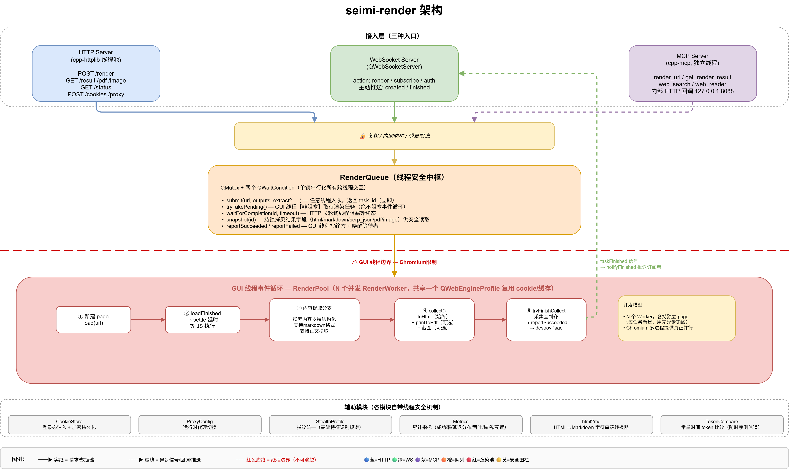

## 构建与运行

### 安装依赖

| 平台 | 命令 |
|------|------|
| Windows | `scripts\setup-windows.bat` |
| Linux   | `sh scripts\setup-linux.sh` |
| macOS   | `sh scripts\setup-macos.sh` |

### 构建打包

| 平台 | 命令 |
|------|------|
| Windows | `scripts\package-windows.bat` |
| Linux   | `sh scripts\package-linux.sh` |
| macOS   | `sh scripts\package.sh` |

## 快速开始

启动服务（默认无头 offscreen）：

### MacOs
```bash
build/seimi-render.app/Contents/MacOS/seimi-render --http-port 8088 --ws-port 8089
```

### AI工具使用示例
标准通用MCP工具配置：
```
{
  "mcpServers": {
    "seimi-render": {
      "type": "http",
      "url": "http://127.0.0.1:8090/mcp"
    }
  }
}
```
> 注意：如果带密码启动，需要增加授权信息。可以去 [管理后台](#浏览器图形化界面可远程管理后台) **配置示例** 标签页直接拷贝。

### AI工具使用效果参考

seimi-render 通过 MCP 协议接入各类 AI agent 客户端后，agent 可用自然语言直接驱动「渲染网页 → 提取正文 → 结构化分析」全流程，无需用户手写 URL 或解析 HTML。下表给出几种典型用法实测（截图取自真实 agent 会话），基于Seimi-render，你可以自由构建任意数据抓取和分析工作流，如：股票舆情、历史K线分析等等，下面是简单的场景作为功能演示。复杂任务可以自定义Skill把seimi-render作为数据获取的基础能力，完成自己预期的闭环数据工作流搭建。

| 场景 | 说明 | 截图(点击放大) |
|------|------|:----------------:|
| **自然语言驱动渲染** | 在 ZCode 等 agent 客户端里，用户用一句话描述需求（如「我想了解北京种植牙哪些医院靠谱」），agent 自动规划调用 `mcp__seimi-render__browser_search` 同步等待获取结构化搜素引擎结果，如果判断有必要获得更多信息，再用 `get_web_content` 获取具体网页完整内容。 | <a href="docs/images/zcode-agent-usage.jpg" target="_blank"></a> |
| **搜索结果结构化输出** | 调用`browser_search`工具，返回结构化搜索结果，方便Agent处理和识别。 | <a href="docs/images/zcode-agent-mcp-result.png" target="_blank">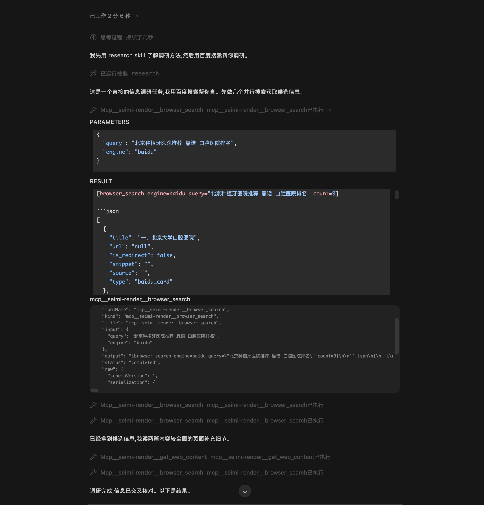</a> |
| **多步迭代** | 复杂需求下，agent 会拆解为多步：先渲染目标页 → 读取结构化结果 → 再渲染关联页或调用搜索引擎结果提取（百度/必应/Google SERP）→ 综合输出。图中展示 agent 在单次会话内连续调用多次 MCP 工具 + 中间思考的完整链路。 | <a href="docs/images/zcode-agent-usage-c2.jpg" target="_blank">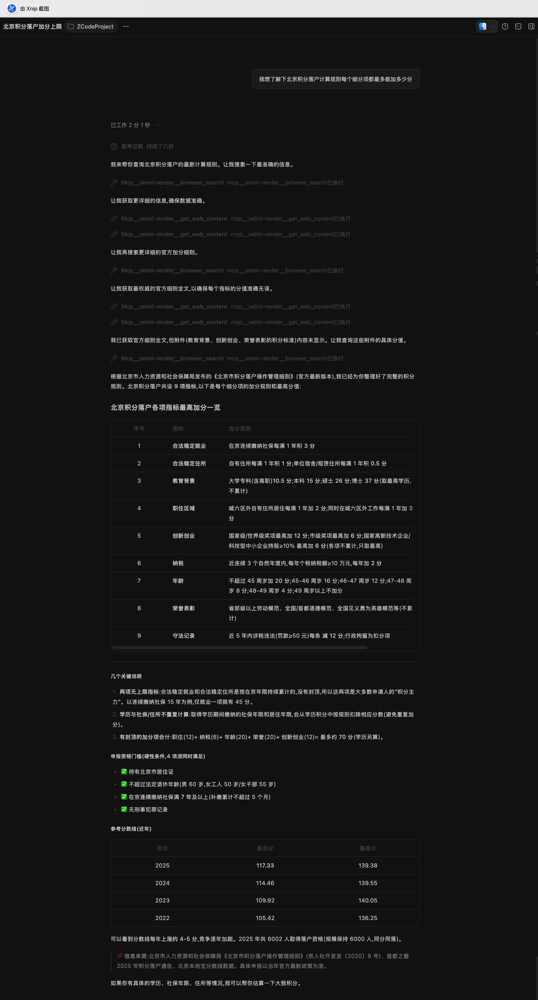</a> |

> 接入方式见上文 [AI工具使用示例](#ai工具使用示例) 章节；配置 JSON 可在管理后台 **配置示例** 标签页一键复制。截图工具调用名 `mcp__seimi-render__*` 对应 [`McpServer`](src/McpServer.cpp) 暴露的工具（详见 [接口文档](#浏览器图形化界面可远程管理后台) 标签页的 MCP 分组）。

### 手动对接或者自己开发应用对接流程

一条命令渲染 `https://www.sohu.com/` 并拿到 HTML（提交 + 长轮询合一）：

```bash
curl -X POST http://localhost:8088/render \
  -H "Content-Type: application/json" \
  -d '{"url":"https://www.sohu.com/","settle_ms":2500,"long_poll_ms":35000}'
```

返回（已格式化，HTML 省略）：

```json
{
  "task_id": "a3f1...",
  "url": "https://www.sohu.com/",
  "state": "succeeded",
  "elapsed_ms": 8550,
  "html": "<!DOCTYPE html><html lang=\"zh-CN\"><head><title>搜狐</title>..."
}
```

实测数据：搜狐首页（`https://www.sohu.com/`）渲染耗时 **~8.5s**，返回 HTML **~220KB**，含 44 个 `<script>`、406 个链接，标题为「搜狐」——即 Chromium 执行完 JS 后的完整 DOM。

## 命令行参数

| 参数 | 默认值 | 说明 |
|------|--------|------|
| `--http-port <n>` | `8088` | HTTP 服务端口 |
| `--ws-port <n>` | `8089` | WebSocket 服务端口 |
| `--mcp-port <n>` | `8090` | MCP (Model Context Protocol) HTTP 端口，供 Claude Code / Cursor 等 agent 接入 |
| `--host <addr>` | `127.0.0.1` | 绑定地址；对外暴露用 `0.0.0.0` |
| `--concurrency <n>` | `3` | WebEngine 渲染槽并发数（详见下方 [并发与吞吐](#并发与吞吐---concurrency)） |
| `--http-threads <n>` | `8` | HTTP 工作线程数 |
| `--settle-ms <n>` | `2000` | 默认 JS settle 延时，`loadFinished` 后等待 JS 执行的毫秒数（0–30000） |
| `--load-timeout-ms <n>` | `20000` | 单任务总超时（毫秒） |
| `--windowed` | offscreen | 强制原生窗口 QPA 平台；默认 offscreen 无头模式 |
| `--no-sandbox` | 关闭 | 禁用 Chromium sandbox；WSL2 / 容器 / root 常需开启 |
| `--sandbox` | 关闭 | 强制启用 Chromium sandbox（覆盖 root 自动判定） |
| `--verbose-chromium` | 关闭 | 显示 Chromium / web console 日志（默认过滤已知噪音） |
| `--password <pw>` | — | 管理密码。（不安全：`ps`/进程列表可见明文，推荐用下面两种方式） |
| `--password-file <f>` | — | 从文件第一行读取密码（推荐） |
| `SEIMI_PASSWORD` 环境变量 | — | 从环境变量读取密码（推荐）。优先级：`--password` > `--password-file` > `SEIMI_PASSWORD`。不设 = 无密码、开放访问 |
| `--no-admin` | 关闭（admin 开启） | 禁用内置管理界面；默认 `GET /` 提供管理控制台 |
| `--trusted-proxy <list>` | — | 逗号分隔的受信反向代理 IP/CIDR（如 `10.8.0.0/16,127.0.0.1`）。设置后 `/api/login` 限流基于从 `X-Forwarded-For` 提取的真实客户端 IP；未设置时使用 TCP 对端地址（忽略 XFF，防伪造） |
| `--proxy <url>` | — | 所有 Chromium 流量的上游代理。格式 `http://[user:pass@]host:port` 或 `socks5://[user:pass@]host:port`。经 `QNetworkProxy::setApplicationProxy` 设置，支持运行时 `POST /proxy` 热切换无需重启。`type=direct` 清除 |
| `--no-stealth` | 关闭（stealth 开启） | 禁用浏览器指纹统一。默认开启 stealth，将所有渲染实例伪装成同一 Chrome 桌面环境（UA/screen/WebGL/canvas），融入人群以绕过基础反爬（如 Google） |
| `--no-warmup` | 关闭（warmup 开启） | 关闭启动 Google 会话预热。默认开启：进程启动时先以隐藏 page 加载一次 `--warmup-url`（默认 https://www.google.com/）拿到 NID/CONSENT 等会话 cookie，**再**启动 dispatch 定时器接业务请求——冷启动零 cookie 直打搜索是 Google 风控的最高危窗口，预热能显著降低首条搜索的 sorry 概率 |
| `--warmup-url <url>` | `https://www.google.com/` | 会话预热目标 URL（必须 http/https）。仅在 warmup 开启时使用；一般无需改，特殊环境（如走代理时 google.com 不通）可换成能稳定返回 google 域 cookie 的镜像。warmup 自带失败自适应：连续 3 次预热失败（约 90min，Google 不可达）会自动暂停 30min 周期、改用 5min 低频探活；探活成功立即恢复正常周期。状态变化在服务日志里以 `[warmup] SUSPENDED` / `[warmup] RESUMED` 标记 |
| `--help` | — | 显示帮助信息 |

### 并发与吞吐（`--concurrency`）

`--concurrency` 是吞吐能力的核心调节阀：每个渲染槽是一个独立的 `QWebEnginePage`，共享同一个 GUI 线程事件循环，由 Chromium 内部多进程提供真正的 CPU/网络并行。**槽数越多，同时能渲染的任务越多，整体吞吐越高**——但存在拐点。

实测数据（链接池 80 条媒体文章 — 搜狐/网易/新浪/澎湃 各 20，16 核 / 32 线程机器，每档持续 2 分钟）：

| `--concurrency` | 吞吐 (req/s) | 相对提升 | p50 (ms) | p99 (ms) | 成功率 |
|----------------:|:------------:|:--------:|:--------:|:--------:|:------:|
| 2 | 0.31 | 基准 | 6125 | 9497 | 100% |
| 4 | 0.64 | +106% | 6012 | 8322 | 100% |
| 8 | 1.24 | +300% | 5984 | 8857 | 100% |
| 12 | 1.30 | +319% | 8697 | 12265 | 100% |
| 16 | 1.29 | +316% | 11757 | 17356 | 100% |
| 20 | 1.29 | +316% | 14460 | 18538 | 100% |

## 浏览器图形化界面可远程管理后台

seimi-render 内置一个浏览器管理控制台(`GET /`,访问根路径即打开),把「查看运行状态、测试渲染、管理 cookie、配置 Agent 接入、查接口文档」全收进一个 Web 界面——本地或远程都能用,无需 SSH 进服务器敲 curl。**默认开启**,`--no-admin` 可关闭。支持设置鉴权。

控制台各标签页介绍参见下表:

| 标签页 | 用途 | 截图(点击放大) |
|--------|------|:----------------:|
| **运行时统计** | 监控大盘:运行时长、总请求/成功/失败/成功率、吞吐(req/s)、延迟分布(min/avg/p50/p90/p99/max)、输出类型需求、按域名的请求量与成功率 Top-N、队列快照。适合容量规划、定位高失败率站点。 | <a href="docs/images/runtime-info.png" target="_blank">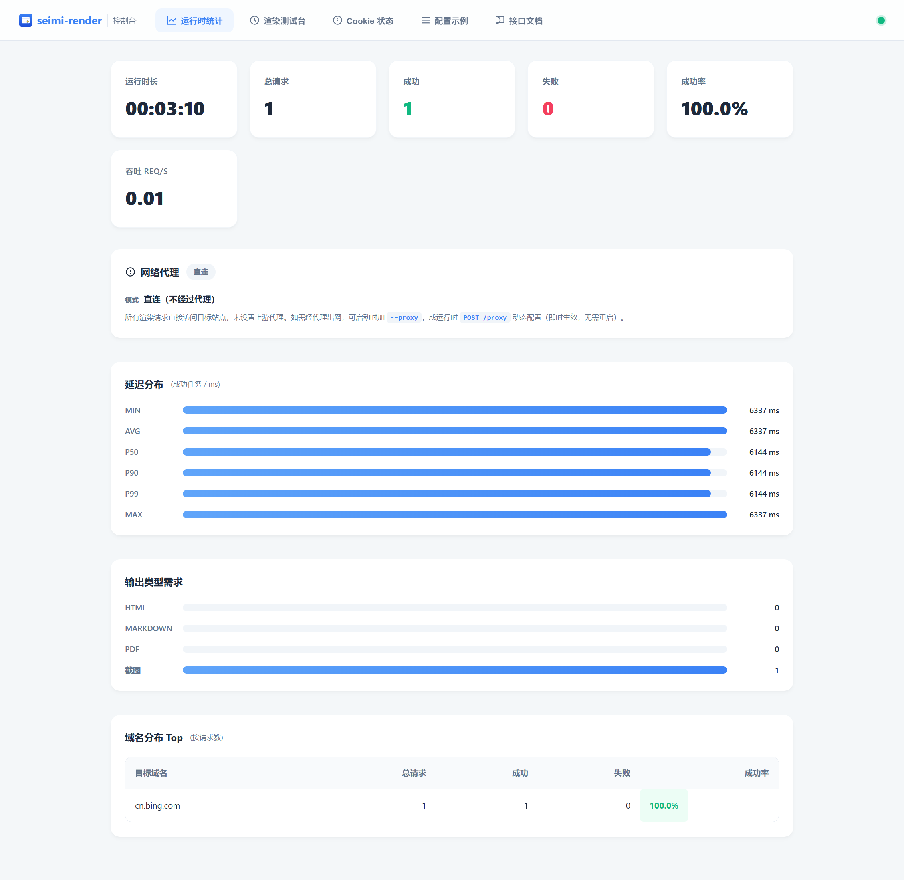</a> |
| **渲染测试台**(中文) | 核心调试工具:输入 URL,可调 settle_ms / 长轮询、勾选输出格式(HTML/Markdown/PDF/截图)、选截图编码与 markdown 算法、**站点特定提取**(百度/必应/Google SERP)。下图演示必应搜索结果提取出 10 条去广告结果。 | <a href="docs/images/bing-search-render.png" target="_blank">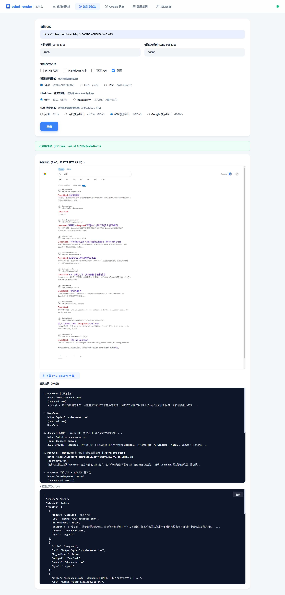</a> |
| **渲染测试台**(English) | 同一界面切到 English(右上角「中」切回中文),演示 Google 搜索结果结构化提取(`extract=google_serp`)。 | <a href="docs/images/google-search-extract-en.png" target="_blank">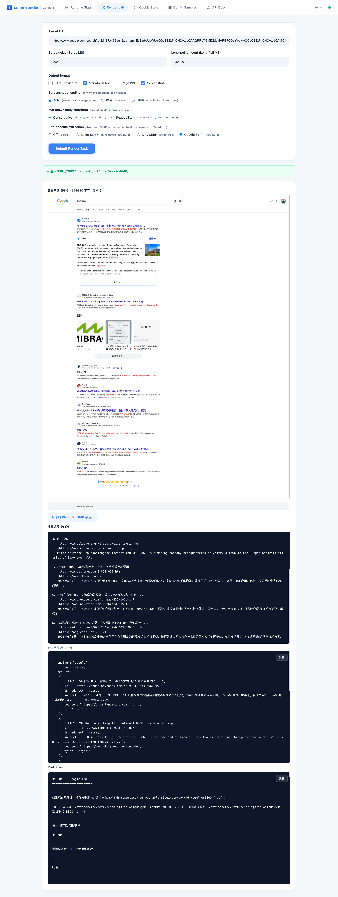</a> |
| **Cookie 状态** | 查看渲染服务持有的登录态 cookie,按域名展示「携带 cookie 数量」(不含 value,防泄露),与浏览器插件对账。「清空当前会话」/「永久删除」分别清内存会话与加密持久化存储(`data/cookies.dat`)。 | <a href="docs/images/cookies.png" target="_blank">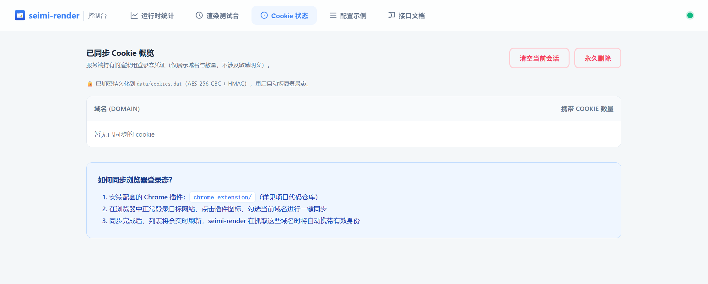</a> |
| **配置示例** | 一键复制 Agent 接入与调用配置:Claude Code / Cursor 的 `mcpServers` JSON、curl 调 `/render` 示例、WebSocket 示例,以及当前访问 token(启用 `--password` 时显示)。 | <a href="docs/images/config-show.png" target="_blank">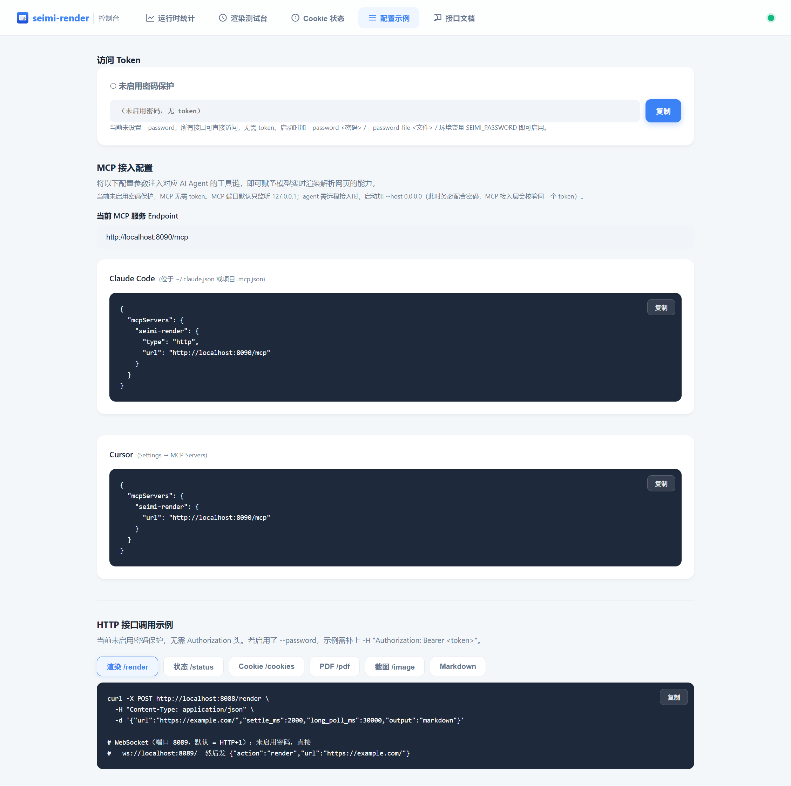</a> |
| **接口文档** | 交互式 API 文档:左目录按「HTTP REST / MCP 工具 / WebSocket」分组(16 HTTP 端点 + 4 MCP 工具 + WS 的 render/subscribe/auth),右详情含参数表、curl/JSON 示例、响应示例与错误码,均可一键复制。 | <a href="docs/images/api-docs.png" target="_blank">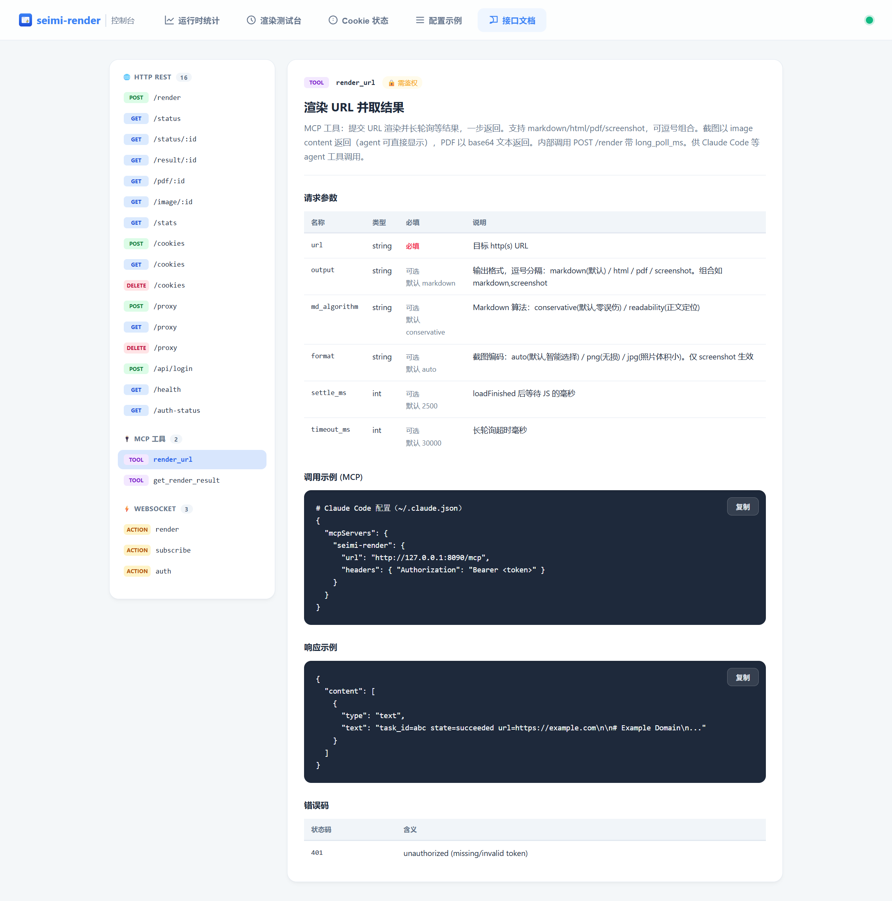</a> |

> cookie 同步来源见上文 [浏览器插件](#浏览器插件) 章节。管理界面是纯静态资源([`admin-ui/`](admin-ui/)),随二进制打包分发,不依赖外部服务。远程访问需显式 `--host 0.0.0.0` 并强烈建议配置 `--password`(管理界面可改代理、注入 cookie,是高权限入口)。

## 浏览器插件

seimi-render 默认Chromum内核渲染,没有你的登录态。要渲染「登录后才看得见」的页面(个人后台、付费内容、内部系统、需登录的搜索结果等),可以先把浏览器里的登录 cookie 同步过来。配套提供 **Chrome 插件**([`chrome-extension/`](chrome-extension/))一键完成。

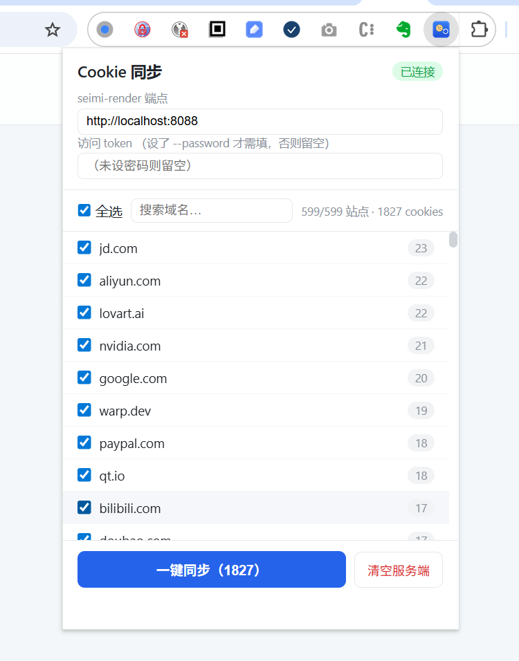

插件读取浏览器**所有** cookie,按域名聚合,你勾选后一键 POST 到 seimi-render 的 `/cookies` 接口。之后渲染这些域名的页面时,Chromium 会自动带上登录态。

### 安装(开发者模式加载)

1. 启动 seimi-render 服务(默认 `http://localhost:8088`)。
2. Chrome 打开 `chrome://extensions` → 右上角开「**开发者模式**」。
3. 点「**加载已解压的扩展程序**」→ 选 [`chrome-extension/`](chrome-extension/) 目录。
4. 工具栏出现 seimi-render 图标,点开即用。

> 支持 Chrome / Edge / Brave 等基于 Chromium 的浏览器(MV3)。Firefox 的 API 名不同,需自行适配。

### 操作演示

1. **点工具栏插件图标** → 弹窗自动读取浏览器所有 cookie,按域名聚合显示。
   - 顶部确认 seimi-render 端点(默认 `http://localhost:8088`,会记忆);设了 `--password` 时在「访问 token」填入对应 token。
   - 右上角徽标显示连接状态(绿色「已连接」/「未连接」/「检测中」),确认插件能连上服务。
2. **筛选要同步的域名**:
   - 顶部「全选」一键全选/取消。
   - 搜索框输入关键词过滤(几百个域名也能秒级定位)。
   - 列表按 cookie 数倒序排列——登录态重的站排最前(如截图中 `jd.com 23`、`aliyun.com 22`)。
   - 默认全选,建议**只勾选需要的域名**(别把银行/邮箱等敏感会话也灌进去)。
3. **点蓝色「一键同步 (N)」按钮** → 插件把勾选域名的 cookie 批量 POST 到 `/cookies`,完成后自动对账,显示「已同步 N cookies(服务端共 M)」,N/M 一致即成功。
4. 之后 seimi-render 渲染这些域名的页面时自动带上登录态。

> 「清空服务端」按钮 = 一键调 `DELETE /cookies` 清空 seimi-render 上已同步的 cookie(换账号/调试时用)。

### 查看服务端已同步的 cookies

同步后可在 seimi-render 管理界面(`GET /`)的「**Cookie 状态**」页查看当前渲染服务持有的 cookie 列表:


- 表格按域名展示「携带 COOKIE 数量」,与插件对账。
- 右上角「清空当前会话」/「永久删除」可分别清除内存中的会话 cookie 与持久化存储。
- 页面提示 **cookie 已加密持久化到 `data/cookies.dat`**,重启自动恢复登录态——所以同步一次后,服务重启无需重新同步。

> **隐私**:插件只读 cookie 明文、不存储其他信息;`GET /cookies` 概览接口只返回「域名→数量」不含 cookie value,防会话泄露;cookie 加密落盘,密钥由编译期 pepper + 机器绑定盐(`data/seimi.key`)PBKDF2 派生,换机器即失效。详见 [`chrome-extension/README.md`](chrome-extension/README.md)。

## HTTP API

| 方法 | 路径 | 说明 |
|------|------|------|
| GET  | `/` | 管理界面 |
| POST | `/render` | 提交渲染任务（可带 `long_poll_ms` 同步等结果） |
| GET  | `/status/:id` | 查询单个任务状态（非阻塞） |
| GET  | `/status` | 运行时全景：累计计数、成功率、延迟分布、吞吐、域名分布、队列快照 |
| GET  | `/result/:id?timeout=N` | 长轮询拉取 HTML（默认 25s） |
| POST | `/cookies` | 同步浏览器登录态 cookies（插件用） |
| GET  | `/cookies` | 已同步 cookie 概览（域名→数量，不含 value） |
| DELETE | `/cookies` | 清空已同步的 cookie |
| GET  | `/stats` | 队列统计（简单快照，向后兼容） |

### 响应字段

| 字段 | 说明 |
|------|------|
| `task_id` | 任务 ID（16 位十六进制） |
| `url` | 提交的 URL |
| `state` | `pending` / `running` / `succeeded` / `failed` |
| `html` | 渲染后的完整 HTML（仅 `succeeded` 时有） |
| `error` | 失败原因（仅 `failed` 时有）。**反爬拦截类失败**的 `error` 以 `blocked:` 开头，典型形如 `blocked: google /sorry/ page (2 retries exhausted)`（命中 Google 验证页 → 自动退避重试 → 重试耗尽判 blocked） |
| `blocked` | 布尔，仅在 `state=failed` 且失败因反爬拦截时为 `true`（典型场景：Google `/sorry/` 验证页重试耗尽）。配合上面的 `error` 前缀 `blocked:`，调用方可显式区分「反爬拦截」与「超时/网络错」两条失败路径 |
| `elapsed_ms` | 从开始渲染到当前的耗时（ms） |

### 提交任务（异步）

提交后立即返回 `pending`，自行轮询或用 WebSocket 等结果：

```bash
curl -X POST http://localhost:8088/render \
  -H "Content-Type: application/json" \
  -d '{"url":"https://www.sohu.com/","settle_ms":2500}'
# => {"task_id":"a3f1...","url":"https://www.sohu.com/","state":"pending"}
```

带长轮询（提交后阻塞，直到完成或超时，一步拿结果）：

```bash
curl -X POST http://localhost:8088/render \
  -H "Content-Type: application/json" \
  -d '{"url":"https://www.sohu.com/","settle_ms":2500,"long_poll_ms":35000}'
# succeeded => {"task_id":"...","state":"succeeded","html":"...","elapsed_ms":8550}
# 超时未完成 => {"task_id":"...","state":"running","elapsed_ms":35000}
```

请求参数：
- `url`（必填）：http/https 地址
- `settle_ms`（可选，默认 2000）：`loadFinished` 后等待 JS 执行的毫秒数（0–30000）；搜狐这类内容多的页面建议 2500+
- `long_poll_ms`（可选，默认 0）：长轮询等待结果的毫秒数（>0 时阻塞至完成或超时，上限 60000）

### 查询状态

```bash
curl http://localhost:8088/status/a3f1...
# => {"task_id":"a3f1...","url":"https://www.sohu.com/","state":"running","elapsed_ms":1203}
```

### 长轮询拉取 HTML

适合「先异步提交、稍后再来取结果」的场景：

```bash
curl "http://localhost:8088/result/a3f1...?timeout=30000"
# 完成时: {"task_id":"...","state":"succeeded","html":"<!DOCTYPE html>...","elapsed_ms":8550}
# 超时未完成: {"task_id":"...","state":"running","elapsed_ms":30000}
# 失败: {"task_id":"...","state":"failed","error":"...","elapsed_ms":...}
# 反爬拦截失败（Google /sorry/ 重试耗尽）:
#   {"task_id":"...","state":"failed","error":"blocked: google /sorry/ page (2 retries exhausted)","blocked":true,"elapsed_ms":...}
```

> **反爬失败类型化**：当渲染 Google 等站点命中验证页（典型为 `/sorry/`）时，seimi-render 会自动退避重试（全新 page，2 次），重试仍命中则判为 `blocked` 失败——响应里 `error` 前缀 `blocked:` + `blocked:true` 双标记，调用方可据此显式区分「反爬拦截」与「超时/网络错」，前者建议换引擎/走代理/IP 池，后者只需重试。统计层 `/status` 同时累加 `blocked_exhausted`（见下）。

### 运行时状态（`GET /status`）

全局运维视图：自启动以来的累计计数、成功率、渲染延迟分布（min/avg/p50/p90/p99/max）、吞吐、输出类型需求分布、**按域名的请求量分布**，以及当前队列快照。适合做监控大盘、容量规划、定位哪类站点失败率高。

```bash
curl http://localhost:8088/status
# 可带 ?domains=N 控制返回的域名条数（默认 20，上限 200）：
curl 'http://localhost:8088/status?domains=50'
```

返回（已格式化）：

```json
{
  "started_at_ms": 1781876333526,
  "uptime_ms": 1300620,
  "uptime_human": "00:21:40",
  "queue": {
    "total": 2, "pending": 0, "running": 1, "done": 1
  },
  "totals": {
    "requests": 1280, "succeeded": 1244, "failed": 36, "success_rate": 0.972,
    "blocked_total": 14, "blocked_recovered": 9, "blocked_exhausted": 5
  },
  "latency_ms": {
    "min": 980, "avg": 5230.4, "p50": 4120, "p90": 8910, "p99": 15630, "max": 28010
  },
  "throughput_per_sec": 0.985,
  "outputs": { "html": 320, "markdown": 940, "pdf": 20 },
  "domains": {
    "distinct": 87,
    "top": [
      { "host": "www.google.com", "total": 210, "succeeded": 205, "failed": 5, "blocked": 14, "success_rate": 0.976 },
      { "host": "www.sohu.com",   "total": 600, "succeeded": 598, "failed": 2, "blocked": 0,  "success_rate": 0.997 }
    ]
  }
}
```

> 上面 `totals` / `domains.top[]` 中带 `blocked` 的字段是 **反爬拦截三态计数**（与 `succeeded`/`failed` 正交，仅在任务到达终态时累加一次）：

字段说明：

| 字段 | 说明 |
|------|------|
| `started_at_ms` / `uptime_ms` / `uptime_human` | 启动时刻、运行时长（ms 与人类可读） |
| `queue` | 当前队列实时快照（同 `/stats`） |
| `totals.requests/succeeded/failed` | 自启动以来的累计终态计数 |
| `totals.success_rate` | `succeeded / requests`，0–1 |
| `totals.blocked_total` | 反爬拦截页检测事件总数（含重试中的每次命中——一次任务命中 sorry 后退避重试，重试再次命中会被记 2 次） |
| `totals.blocked_recovered` | 经历过拦截但**最终成功**的任务数（重试后跳出 sorry 的任务计入这里，体现 stealth + 预热 + 重试的综合修复力） |
| `totals.blocked_exhausted` | 重试耗尽判 `blocked` **失败**的任务数（对应响应里的 `blocked:true`）。三者关系：`blocked_recovered + blocked_exhausted` ≤ 命中过拦截的任务总数；`blocked_total` ≥ `blocked_recovered + blocked_exhausted`（含重试中的多次命中） |
| `latency_ms` | **仅成功任务**的渲染耗时分布；失败不计入。p50/p90/p99 用对数桶直方图近似（固定内存，不存逐样本） |
| `throughput_per_sec` | `requests / uptime(秒)` |
| `outputs.html/markdown/pdf` | 各输出类型被请求的次数（位标记统计） |
| `domains.distinct` | 见过的不同 host 总数 |
| `domains.top[]` | 按 `total` 倒序的 top-N 域名，含各自的 succeeded/failed/success_rate |
| `domains.top[].blocked` | 该域名累计拦截页检测次数（含重试中的每次命中）。定位高风控站点（如 `www.google.com` 的 `blocked` 远高于其他域）时最有用 |

> **资源开销**：指标只在任务到达终态（成功/失败）时更新一次，非热路径；延迟用固定 32 桶直方图（O(1) 内存、O(1) 更新）；域名映射设 1000 host 上限，超限剔除最冷门者，防止恶意/爬虫场景下 host map 无限膨胀。`GET /status` 查询时一次性加锁拷贝快照，top-N 排序仅对返回的 N 条做，开销可忽略。

### 解析渲染结果示例（Python）

```python
import requests, json

# 提交 + 长轮询一步到位
r = requests.post("http://localhost:8088/render", json={
    "url": "https://www.sohu.com/",
    "settle_ms": 2500,
    "long_poll_ms": 35000,
}).json()

if r["state"] == "succeeded":
    html = r["html"]
    print("HTML 长度:", len(html))
    import re
    title = re.search(r"<title>(.*?)</title>", html, re.S)
    print("标题:", title.group(1).strip() if title else "(无)")
    print("链接数:", html.lower().count("href"))
```

输出：
```
HTML 长度: 221576
标题: 搜狐
链接数: 406
```

### 交互时序图

**提交渲染（长轮询一步取结果，最常用）**：客户端带 `long_poll_ms` 提交，服务端阻塞至渲染完成（或超时）再返回。

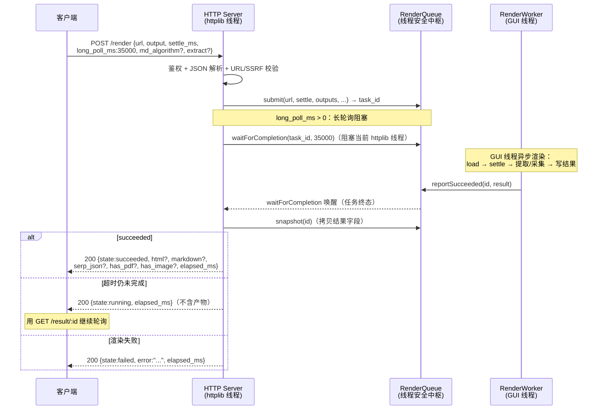
```mermaid
sequenceDiagram
    participant C as 客户端
    participant H as HTTP Server<br/>(httplib 线程)
    participant Q as RenderQueue<br/>(线程安全中枢)
    participant W as RenderWorker<br/>(GUI 线程)

    C->>H: POST /render {url, output, settle_ms,<br/>long_poll_ms:35000, md_algorithm?, extract?}
    H->>H: 鉴权 + JSON 解析 + URL/SSRF 校验
    H->>Q: submit(url, settle, outputs, ...) → task_id
    Note over H,Q: long_poll_ms > 0：长轮询阻塞
    H->>Q: waitForCompletion(task_id, 35000)（阻塞当前 httplib 线程）
    Note over W: GUI 线程异步渲染：<br/>load → settle → 提取/采集 → 写结果
    W->>Q: reportSucceeded(id, result)
    Q-->>H: waitForCompletion 唤醒（任务终态）
    H->>Q: snapshot(id)（拷贝结果字段）
    alt succeeded
        H-->>C: 200 {state:succeeded, html?, markdown?,<br/>serp_json?, has_pdf?, has_image?, elapsed_ms}
    else 超时仍未完成
        H-->>C: 200 {state:running, elapsed_ms}（不含产物）
        Note over C: 用 GET /result/:id 继续轮询
    else 渲染失败
        H-->>C: 200 {state:failed, error:"...", elapsed_ms}
    end
```

**异步提交 + 二次拉取（大文件 / 截图 / PDF）**：`long_poll_ms:0` 立即返回 `pending`，后续按需拉取产物。

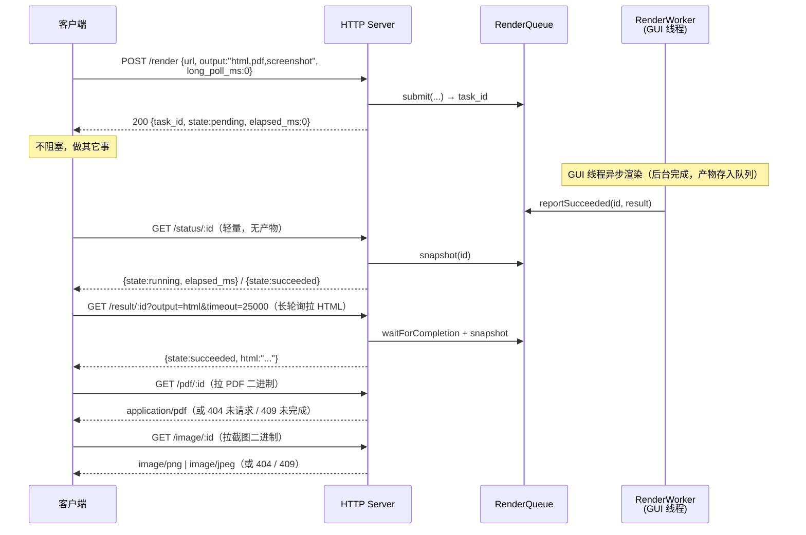
```mermaid
sequenceDiagram
    participant C as 客户端
    participant H as HTTP Server
    participant Q as RenderQueue
    participant W as RenderWorker<br/>(GUI 线程)

    C->>H: POST /render {url, output:"html,pdf,screenshot",<br/>long_poll_ms:0}
    H->>Q: submit(...) → task_id
    H-->>C: 200 {task_id, state:pending, elapsed_ms:0}
    Note over C: 不阻塞，做其它事
    Note over W: GUI 线程异步渲染（后台完成，产物存入队列）
    W->>Q: reportSucceeded(id, result)
    C->>H: GET /status/:id（轻量，无产物）
    H->>Q: snapshot(id)
    H-->>C: {state:running, elapsed_ms} / {state:succeeded}
    C->>H: GET /result/:id?output=html&timeout=25000（长轮询拉 HTML）
    H->>Q: waitForCompletion + snapshot
    H-->>C: {state:succeeded, html:"..."}
    C->>H: GET /pdf/:id（拉 PDF 二进制）
    H-->>C: application/pdf（或 404 未请求 / 409 未完成）
    C->>H: GET /image/:id（拉截图二进制）
    H-->>C: image/png | image/jpeg（或 404 / 409）
```

**搜索引擎结果结构化提取（`extract=baidu_serp/bing_serp/google_serp`）**：与普通渲染同路径，settle 后走 SERP 提取分支，响应多一个 `serp_json` 字段。

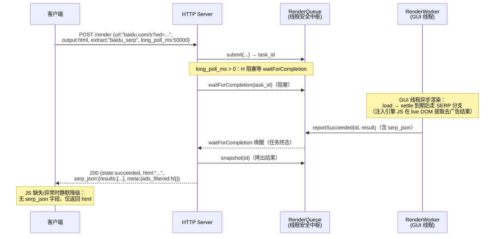
```mermaid
sequenceDiagram
    participant C as 客户端
    participant H as HTTP Server
    participant Q as RenderQueue<br/>(线程安全中枢)
    participant W as RenderWorker<br/>(GUI 线程)

    C->>H: POST /render {url:"baidu.com/s?wd=...",<br/>output:html, extract:"baidu_serp", long_poll_ms:50000}
    H->>Q: submit(...) → task_id
    Note over H,Q: long_poll_ms > 0：H 阻塞等 waitForCompletion
    H->>Q: waitForCompletion(task_id)（阻塞）
    Note over W: GUI 线程异步渲染：<br/>load → settle 到期后走 SERP 分支<br/>（注入引擎 JS 在 live DOM 提取去广告结果）
    W->>Q: reportSucceeded(id, result)（含 serp_json）
    Q-->>H: waitForCompletion 唤醒（任务终态）
    H->>Q: snapshot(id)（拷出结果）
    H-->>C: 200 {state:succeeded, html:"...",<br/>serp_json:{results:[...], meta:{ads_filtered:N}}}
    Note over C: JS 缺失/异常时静默降级：<br/>无 serp_json 字段，仅返回 html
```

## MCP（供 Claude Code / Cursor 等 agent 接入）

seimi-render 内置一个 **MCP（Model Context Protocol）server**（默认端口 `8090`，基于 [hkr04/cpp-mcp](https://github.com/hkr04/cpp-mcp)，Streamable HTTP 传输，符合 2025-03-26 规范）。这让 Claude Code、Cursor 等 AI agent 工具能**直接把 seimi-render 当成渲染工具来调用**——agent 自动决定何时渲染网页、拿到渲染后的内容。

### 暴露的 tools

共 4 个工具，按「语义层级」从高到低排列——agent 优先用高层工具，底层 `render_url` 兜底所有它覆盖不到的场景：

| tool | 作用 | 必填参数 | 可选参数 |
|------|------|----------|----------|
| `browser_search` | 关键词搜索：自动构造搜索引擎 URL 并渲染，返回结果列表。**没给具体 URL、只想「搜一下/查一下」时优先用** | `query` | `engine`(google/bing/baidu/duckduckgo，默认 google)、`settle_ms`(2500)、`timeout_ms`(45000) |
| `get_web_content` | 读单篇文章正文：用 readability 提取干净 markdown（去导航/广告/侧栏）。**给了具体 URL 要读全文时优先用** | `url` | `md_algorithm`(readability/conservative，默认 readability)、`settle_ms`(2500)、`timeout_ms`(45000) |
| `render_url` | 全功能渲染器：任意 URL、任意输出组合。**需要 PDF/截图/原始 HTML/手动指定搜索引擎 URL/自定义 settle 时用** | `url` | `output`(markdown/html/pdf/screenshot 逗号组合，默认 markdown)、`md_algorithm`(conservative/readability，默认 conservative)、`format`(auto/png/jpg，仅影响截图)、`settle_ms`(2500)、`timeout_ms`(45000) |
| `get_render_result` | 按 task_id 补取已提交任务的结果：`render_url` 超时返回 `running` 后轮询，或重新拉取已完成产物 | `task_id` | `output`(markdown/html/screenshot/pdf，默认 markdown)、`timeout_ms`(5000) |

**工具选择速查**（每个工具的 description 里也写了，agent 会自动判断）：

- 用户说「搜一下 / 查一下 / Google it / 帮我了解…」但没给 URL → `browser_search`
- 用户给了文章/页面 URL 要读正文 → `get_web_content`
- 需要 PDF / 截图 / 原始 HTML / conservative markdown / 手动拼搜索引擎 URL / 调 settle → `render_url`
- 上一步返回 `state=running`（慢站点/反爬没渲完）→ `get_render_result` 轮询补取

**输出格式说明**（`render_url` 的 `output` 参数）：

| 值 | 返回形式 |
|----|----------|
| `markdown`（默认） | MCP text content，干净可读文本 |
| `html` | MCP text content，渲染后的完整 HTML |
| `pdf` | 先拉 `/pdf/<id>` 二进制 → base64 编码成 text content（agent 解码后存为 .pdf） |
| `screenshot` | 先拉 `/image/<id>` 二进制 → MCP 原生 **image content**（base64 + mimeType，agent 可直接显示图片） |

支持逗号组合（如 `markdown,screenshot`）：文本部分在前，截图作 image content 跟在后，PDF 作 base64 text 附在末尾。

> **`browser_search` 的引擎差异**：`baidu`/`bing`/`google` 走 SERP 结构化提取（`extract=baidu_serp` 等），返回去广告的 JSON 结果数组（每条含 title/url/snippet/source，附「相关搜索」）；`duckduckgo` 返回整页 conservative markdown（可能含广告）。命中反爬验证页时返回 `BLOCKED` 提示并建议换引擎/重试。

工具内部通过本机 HTTP（`127.0.0.1:8088`）调渲染 API，复用现成的线程安全渲染链路——MCP server 全程**不直接碰 WebEngine**。

### 鉴权（启用 `--password` 时）

seimi-render 启用密码（`--password` / `--password-file` / `SEIMI_PASSWORD`）时，MCP 端点（`:8090`）同样受保护：每个请求必须带 `Authorization: Bearer <token>`，token 与 HTTP/WS **共用同一确定性 token**（`HttpServer::computeToken` 派生）。MCP server 跑在独立线程，用恒定时间比较校验 token（防时序侧信道）。

各 agent 客户端通过请求头带 token（具体字段名见各客户端文档，多数支持自定义 headers）：

```json
{
  "mcpServers": {
    "seimi-render": {
      "type": "http",
      "url": "http://localhost:8090/mcp",
      "headers": {
        "Authorization": "Bearer <你的 token>"
      }
    }
  }
}
```

> 未启用密码时无需此配置（默认 MCP 仅绑 `127.0.0.1`，不暴露公网）。

### Claude Code 接入

在 Claude Code 的配置（`~/.claude.json` 或项目 `.mcp.json`）中添加：

```json
{
  "mcpServers": {
    "seimi-render": {
      "type": "http",
      "url": "http://localhost:8090/mcp"
    }
  }
}
```

确保 seimi-render 正在运行（`./build/seimi-render.app/Contents/MacOS/seimi-render`）。接入后，在 Claude Code 里可以直接说"帮我渲染 https://www.sohu.com/ 拿到 markdown"，Claude 会自动调用 `render_url` 工具。

### Cursor 接入

Cursor → Settings → MCP → Add new MCP server：

```json
{
  "mcpServers": {
    "seimi-render": {
      "url": "http://localhost:8090/mcp"
    }
  }
}
```

### 启动参数

```bash
# 默认 MCP 端口 8090
./seimi-render --mcp-port 8090

# 自定义
./seimi-render --http-port 8088 --mcp-port 9090
```

### 手动验证 MCP 端点

MCP 是有状态会话协议（initialize → initialized 通知 → tools/list）。完整流程示例（Streamable HTTP）：

```bash
# 1. initialize，拿到 session id
SID=$(curl -s -D - -X POST http://localhost:8090/mcp \
  -H "Content-Type: application/json" \
  -H "Accept: application/json, text/event-stream" \
  -d '{"jsonrpc":"2.0","id":1,"method":"initialize","params":{"protocolVersion":"2025-03-26","capabilities":{},"clientInfo":{"name":"probe","version":"1"}}}' \
  | grep -i "^mcp-session-id:" | sed 's/.*: //I' | tr -d '\r\n')

# 2. 发 initialized 通知（必须，否则 session 未就绪）
curl -X POST http://localhost:8090/mcp \
  -H "Content-Type: application/json" -H "Accept: application/json, text/event-stream" \
  -H "Mcp-Session-Id: $SID" \
  -d '{"jsonrpc":"2.0","method":"notifications/initialized"}'

# 3. 列出工具
curl -X POST http://localhost:8090/mcp \
  -H "Content-Type: application/json" -H "Accept: application/json, text/event-stream" \
  -H "Mcp-Session-Id: $SID" \
  -d '{"jsonrpc":"2.0","id":2,"method":"tools/list"}'

# 4. 调用 render_url
curl -X POST http://localhost:8090/mcp \
  -H "Content-Type: application/json" -H "Accept: application/json, text/event-stream" \
  -H "Mcp-Session-Id: $SID" \
  -d '{"jsonrpc":"2.0","id":3,"method":"tools/call","params":{"name":"render_url","arguments":{"url":"https://www.sohu.com/"}}}'
```

> 推荐用 [MCP Inspector](https://github.com/modelcontextprotocol/inspector)（`npx @modelcontextprotocol/inspector`）可视化调试：URL 填 `http://localhost:8090/mcp`，它自动处理握手/session，可直接点选工具调用。

### 实现说明

- MCP 库（cpp-mcp）自带一份 cpp-httplib，与项目用的版本不同。为避免 ODR 冲突（同进程两份不同版本 header-only 库会运行时崩溃），构建时**统一用项目那份 httplib**——详见 `CMakeLists.txt` 里 `seimi-mcp` target 的隔离 include path 设计。
- MCP server 跑在独立线程（非阻塞模式，由 cpp-mcp 自管 server + maintenance 线程），HTTP 渲染服务（8088）和 WebSocket（8089）独立工作，三者互不影响。MCP 端口起不来不影响主渲染功能（仅打 warning）。
- **session 容量与回收**：`max_sessions=64`（留多 agent 并发余量），`session_timeout=3600`（maintenance 线程每 10s 回收空闲超 1 小时的 session）。cpp-mcp 已 patch 为「过期 session 自动重建」——client 带任何 session id 来调工具都会成功并就地沿用其 id，故 session 配置只影响内存堆积、不影响可用性。必须用非阻塞 `start(false)` 启动才会起 maintenance 线程，否则 session 只增不减、连满后新连接永久 503。
- **鉴权 patch**：启用密码时，cpp-mcp 上游的 `set_auth_handler` 是空 stub，已在 fork 的 `mcp_server.cpp` 补上 `enforce_auth_` 强制校验，handler 签名 `(token, path) -> bool`。
- MCP 端口绑定与主服务一致：用户未显式 `--host` 时**强制回环**（`127.0.0.1`），避免误开公网；需远程接入才显式 `--host 0.0.0.0`。

### 交互时序图

MCP 工具**不直接碰 WebEngine**，而是经 httplib 客户端回调本机渲染 HTTP API（`127.0.0.1:8088`），再把结果组装成 MCP content（text/image）返回给 agent。

**连接握手 + `render_url`（渲染并取结果）**：

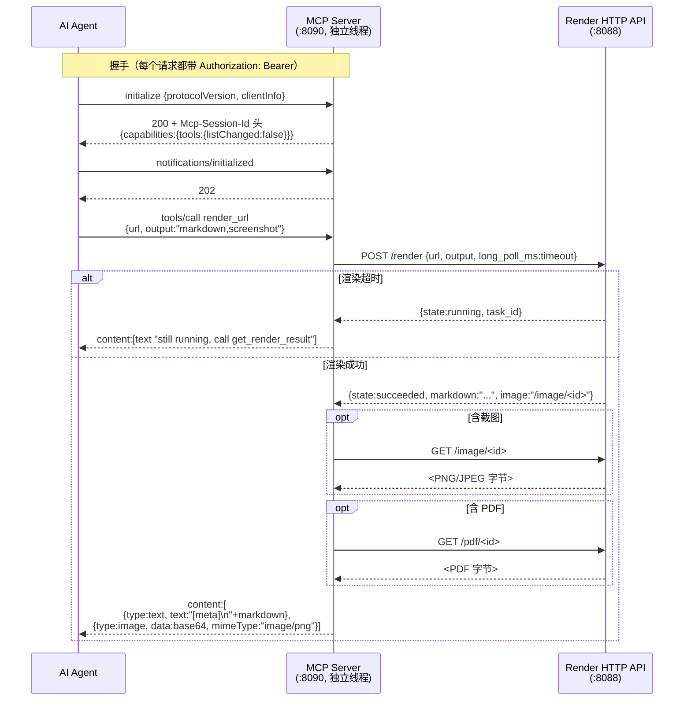
```mermaid
sequenceDiagram
    participant A as AI Agent
    participant M as MCP Server<br/>(:8090, 独立线程)
    participant H as Render HTTP API<br/>(:8088)

    Note over A,M: 握手（每个请求都带 Authorization: Bearer）
    A->>M: initialize {protocolVersion, clientInfo}
    M-->>A: 200 + Mcp-Session-Id 头<br/>{capabilities:{tools:{listChanged:false}}}
    A->>M: notifications/initialized
    M-->>A: 202
    A->>M: tools/call render_url<br/>{url, output:"markdown,screenshot"}
    M->>H: POST /render {url, output, long_poll_ms:timeout}
    alt 渲染超时
        H-->>M: {state:running, task_id}
        M-->>A: content:[text "still running, call get_render_result"]
    else 渲染成功
        H-->>M: {state:succeeded, markdown:"...", image:"/image/<id>"}
        opt 含截图
            M->>H: GET /image/<id>
            H-->>M: <PNG/JPEG 字节>
        end
        opt 含 PDF
            M->>H: GET /pdf/<id>
            H-->>M: <PDF 字节>
        end
        M-->>A: content:[<br/>{type:text, text:"[meta]\n"+markdown},<br/>{type:image, data:base64, mimeType:"image/png"}]
    end
```

**`browser_search`（关键词搜索 + 结构化提取）**：baidu/bing/google 走 `extract` 结构化路径，返回去广告的 JSON 结果。

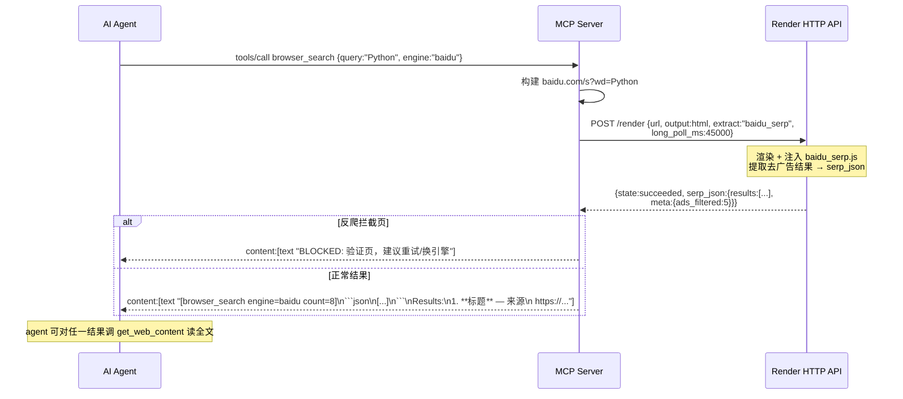
```mermaid
sequenceDiagram
    participant A as AI Agent
    participant M as MCP Server
    participant H as Render HTTP API

    A->>M: tools/call browser_search {query:"Python", engine:"baidu"}
    M->>M: 构建 baidu.com/s?wd=Python
    M->>H: POST /render {url, output:html, extract:"baidu_serp",<br/>long_poll_ms:45000}
    Note over H: 渲染 + 注入 baidu_serp.js<br/>提取去广告结果 → serp_json
    H-->>M: {state:succeeded, serp_json:{results:[...],<br/>meta:{ads_filtered:5}}}
    alt 反爬拦截页
        M-->>A: content:[text "BLOCKED: 验证页，建议重试/换引擎"]
    else 正常结果
        M-->>A: content:[text "[browser_search engine=baidu count=8]\n```json\n[...]\n```\nResults:\n1. **标题** — 来源\n   https://..."]
    end
    Note over A: agent 可对任一结果调 get_web_content 读全文
```

**`get_web_content`（读单篇文章正文）**：单 URL → readability 正文提取，返回干净 markdown。

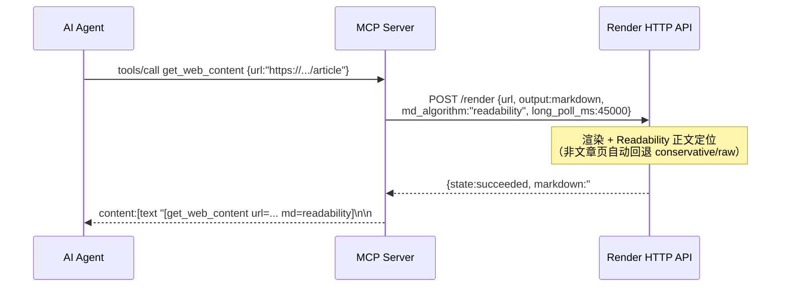
```mermaid
sequenceDiagram
    participant A as AI Agent
    participant M as MCP Server
    participant H as Render HTTP API

    A->>M: tools/call get_web_content {url:"https://.../article"}
    M->>H: POST /render {url, output:markdown,<br/>md_algorithm:"readability", long_poll_ms:45000}
    Note over H: 渲染 + Readability 正文定位<br/>（非文章页自动回退 conservative/raw）
    H-->>M: {state:succeeded, markdown:"# 标题\n\n正文...",<br/>md_algorithm_used:"readability"}
    M-->>A: content:[text "[get_web_content url=... md=readability]\n\n# 标题\n\n正文..."]
```

## Cookie 同步（渲染登录态页面）

seimi-render 默认用干净的 WebEngine profile 渲染，没有登录态。要渲染「登录后才看得见」的页面（个人后台、付费内容等），先把浏览器里的登录 cookie 同步过来。配套提供 **Chrome 插件**（`chrome-extension/`）一键同步。

### Chrome 插件一键同步（推荐）

```bash
# 1. 先启动 seimi-render
./build/seimi-render --http-port 8088 --ws-port 8089
```

1. Chrome 打开 `chrome://extensions` → 开「开发者模式」→「加载已解压的扩展程序」→ 选 `chrome-extension/` 目录。
2. 点工具栏 seimi-render 图标，弹窗自动读取浏览器所有 cookie，按域名聚合（默认全选）。
3. 勾选要同步的域名（支持全选 / 搜索过滤），点「一键同步」。
4. 同步后自动对账显示「已同步 N cookies（服务端共 M）」。

之后渲染这些域名的页面时自动带上登录态。详细见 [`chrome-extension/README.md`](chrome-extension/README.md)。

### HTTP 接口

也可以不用插件，直接调接口（比如从别的工具/脚本同步）：

```bash
# 批量同步 cookies（字段对应 Chrome cookies.getAll() 的输出）
curl -X POST http://localhost:8088/cookies \
  -H "Content-Type: application/json" \
  -d '{"cookies":[
    {"name":"sid","value":"abc","domain":".example.com","hostOnly":false,
     "secure":true,"httpOnly":true,"path":"/","expirationDate":1893456000},
    {"name":"token","value":"xyz","domain":"example.org","hostOnly":true}
  ]}'
# => {"stored":2,"applied":true}

# 概览（域名→数量，不含 value，防会话泄露）
curl http://localhost:8088/cookies
# => {"total":2,"domains":[{"domain":"example.org","count":1},{"domain":".example.com","count":1}]}

# 清空
curl -X DELETE http://localhost:8088/cookies
# => {"cleared":true}
```

字段说明：

| 字段 | 说明 |
|------|------|
| `name` / `value` | 必填 |
| `domain` | 域；`hostOnly=true` 时用作 origin host，不设 setDomain（精确 host 匹配） |
| `hostOnly` | true=仅精确 host（不含子域），false=含子域（domain 自动补前导点） |
| `secure` / `httpOnly` | 直接映射到 cookie 属性 |
| `path` | 默认 `/` |
| `expirationDate` | epoch 秒；≤0 视为会话级 cookie（随进程生命周期） |

> **安全**：cookie 仅存内存（`NoPersistentCookies`），不落盘；服务重启即清空，需重新同步。`GET /cookies` 只返回域名计数不含 value。同步走本机 HTTP（默认 localhost），cookie 不出本机。

## WebSocket 推送

适合「异步提交、服务端主动通知完成」的场景——避免客户端空轮询。WebSocket 支持两种操作，可全程只用一个连接：

- **`render`**：直接发渲染请求（提交 URL），服务端受理后回 `created`，渲染完成推送 `finished`
- **`subscribe`**：订阅一个已有任务（通常由别的 `render` 消息或 HTTP `/render` 创建），完成时推送 `finished`

收到 `finished` 后，用 HTTP `/result/:id` 拉取 HTML。典型全程 WS 流程：

```
客户端 → {"action":"render","url":"https://www.sohu.com/","settle_ms":2500}
服务端 ← {"event":"created","task_id":"..."}      # 受理
服务端 ← {"event":"finished","task_id":"...","state":"succeeded"}  # 完成
```

### 消息格式

连接 `ws://localhost:8089/`（文本帧，JSON 编码）。通信是**请求-响应 + 服务端推送**模型：客户端发请求，服务端先回一条确认（`created`/`subscribed`），之后在任务完成时主动推送 `finished`。

#### 客户端 → 服务端：两种 action

**① `render` —— 提交渲染请求**（推荐，一个连接搞定提交+收结果）

| 字段 | 类型 | 必填 | 说明 |
|------|------|------|------|
| `action` | string | 是 | 固定 `"render"` |
| `url` | string | 是 | http/https 地址 |
| `settle_ms` | int | 否 | loadFinished 后等待 JS 执行的毫秒数（0–30000，默认 2000） |
| `output` | string \| array | 否 | 产物类型，逗号分隔串（`"html,markdown,pdf,screenshot"`）或数组（与 HTTP `/render` 同语义；`md`/`image`/`png`/`jpg` 为别名）。默认 `html` |
| `md_algorithm` | string | 否 | markdown 算法：`conservative`（默认）/ `readability`（与 HTTP 同语义） |
| `format` | string | 否 | 截图编码：`auto`（默认）/ `png` / `jpg`（与 HTTP 同语义） |

服务端收到后向渲染队列提交任务，**自动把本连接订阅到该任务**，并立即回 `created`；渲染完成时推送 `finished`。真实示例：

```json
{"action":"render","url":"https://www.sohu.com/","settle_ms":2500}
```

**② `subscribe` —— 订阅一个已有任务**（任务通常由 HTTP `/render` 或另一条 `render` 消息创建）

| 字段 | 类型 | 必填 | 说明 |
|------|------|------|------|
| `action` | string | 是 | 固定 `"subscribe"` |
| `task_id` | string | 是 | 要订阅的任务 ID（16 位十六进制） |

```json
{"action":"subscribe","task_id":"f1c40ecda5bd41b6"}
```

> 一个连接可以反复发送请求切换/订阅不同任务，新订阅不会清除对旧任务的订阅（同一连接可同时关注多个任务）。

#### 服务端 → 客户端：响应与推送

服务端会发五类消息，用 `event` 字段区分：

| `event` | 触发时机 | 携带字段 |
|---------|----------|----------|
| `created` | `render` 请求已受理并提交到渲染队列 | `task_id`、`url` |
| `subscribed` | `subscribe` 请求合法，订阅成功 | `task_id` |
| `finished` | 订阅的任务到达终态（成功或失败），**主动推送** | `task_id`、`state` |
| `authorized` | 启用密码且鉴权通过（连接 URL `?token=` 或 `auth` 动作）；未启用密码时 `auth` 动作也会回此 | — |
| `error` | 请求非法（缺字段 / 非 JSON / URL 非法 / 未知 action） | `message` |

真实示例（通过 WS 渲染搜狐首页的完整交互，全程一个连接）：

```
客户端 → {"action":"render","url":"https://www.sohu.com/","settle_ms":2500}
服务端 ← {"event":"created","task_id":"64fe7c39de9e404e","url":"https://www.sohu.com/"}    # 已受理
服务端 ← {"event":"finished","task_id":"64fe7c39de9e404e","state":"succeeded"}             # 渲染完成
# 之后用 HTTP GET /result/64fe7c39de9e404e 拉取 HTML
```

`finished` 的 `state` 取值：

| `state` | 含义 |
|---------|------|
| `succeeded` | 渲染成功，HTML 已就绪，可用 `/result/:id` 拉取 |
| `failed` | 渲染失败（加载超时、网络错误、HTTP 4xx/5xx 等），`/result/:id` 返回的 JSON 含 `error` 字段 |

#### 错误响应

请求不合法时，服务端返回 `error` 消息。大多数情况下**连接保持**，可继续发新请求；两类鉴权错误会随后关闭连接（close code `1008` Policy Violation）：

| 客户端发送（错误） | 服务端返回 | 是否关连接 |
|--------------------|------------|------------|
| `hello world`（非 JSON） | `{"event":"error","message":"invalid json"}` | 否 |
| `{"action":"render"}`（缺 `url`） | `{"event":"error","message":"missing 'url'"}` | 否 |
| `{"action":"render","url":"ftp://x"}`（非 http/https） | `{"event":"error","message":"url must be http/https"}` | 否 |
| `{"action":"render","url":"http://10.0.0.1"}`（内网/元数据） | `{"event":"error","message":"url blocked by SSRF guard: ..."}` | 否 |
| `{"action":"subscribe"}`（缺 `task_id`） | `{"event":"error","message":"missing 'task_id'"}` | 否 |
| `{"action":"foo"}`（未知 action） | `{"event":"error","message":"unknown action; expect 'render' or 'subscribe'"}` | 否 |
| 任务表过载（洪泛/积压） | `{"event":"error","message":"server overloaded, retry later"}` | 否 |
| 启用密码但未鉴权就发 render/subscribe | `{"event":"error","message":"unauthorized; send {\"action\":\"auth\",...} or connect with ?token="}` | 是（1008） |
| `{"action":"auth","token":"错"}`（token 错误） | `{"event":"error","message":"invalid token"}` | 是（1008） |

收到 `finished` 后，用 HTTP `/result/:id` 拉取 HTML。

### 用例：渲染搜狐首页并接收完成推送（Python，纯标准库，可直接运行）

全程只用一个 WS 连接完成「提交渲染请求 → 收完成推送」，最后用 HTTP 拉一次 HTML：

```python
import socket, base64, os, struct, json, re
import urllib.request

HTTP, WS_PORT = "http://localhost:8088", 8089

def ws_connect(port):
    s = socket.create_connection(("127.0.0.1", port), timeout=10)
    key = base64.b64encode(os.urandom(16)).decode()
    s.sendall(f"GET / HTTP/1.1\r\nHost: 127.0.0.1:{port}\r\nUpgrade: websocket\r\n"
              f"Connection: Upgrade\r\nSec-WebSocket-Key: {key}\r\n"
              f"Sec-WebSocket-Version: 13\r\n\r\n".encode())
    buf = b""
    while b"\r\n\r\n" not in buf:
        buf += s.recv(4096)
    assert b"101" in buf.split(b"\r\n")[0]
    return s

def ws_send(s, text):
    payload, mask = text.encode(), os.urandom(4)
    h = bytearray([0x81]); l = len(payload)
    if l < 126:       h.append(0x80 | l)
    elif l < 65536:   h.append(0x80 | 126); h += struct.pack(">H", l)
    else:             h.append(0x80 | 127); h += struct.pack(">Q", l)
    h += mask
    s.sendall(bytes(h) + bytes(b ^ mask[i % 4] for i, b in enumerate(payload)))

def ws_recv(s):
    s.recv(1); ln = s.recv(1)[0] & 0x7f
    if ln == 126: ln = struct.unpack(">H", s.recv(2))[0]
    elif ln == 127: ln = struct.unpack(">Q", s.recv(8))[0]
    buf = b""
    while len(buf) < ln: buf += s.recv(ln - len(buf))
    return buf.decode(errors="replace")

# 1) WS 发送 render 请求（搜狐首页）
ws = ws_connect(WS_PORT)
ws_send(ws, json.dumps({"action": "render",
                        "url": "https://www.sohu.com/", "settle_ms": 2500}))
created = json.loads(ws_recv(ws))                 # {"event":"created","task_id":"..."}
assert created["event"] == "created", created
task_id = created["task_id"]
print(f"[受理] task_id={task_id}")

# 2) 等待渲染完成推送
ws.settimeout(60)
finished = json.loads(ws_recv(ws))                # {"event":"finished","state":"succeeded"}
print(f"[推送] {finished['state']}")

# 3) 用 task_id 走 HTTP 拉取渲染后的 HTML
result = json.loads(urllib.request.urlopen(
    f"{HTTP}/result/{task_id}", timeout=60).read())
html = result["html"]
title = re.search(r"<title>(.*?)</title>", html, re.S)
print(f"[结果] HTML={len(html)} 字节 标题={title.group(1).strip()}")
ws.close()
```

实际运行输出（真实数据）：

```
[受理] task_id=64fe7c39de9e404e
[推送] succeeded
[结果] HTML=221331 字节 标题=搜狐
```

### 用例

若已安装 `pip install websockets requests`：

```python
import asyncio, json, re
import websockets, requests

HTTP = "http://localhost:8088"
WS_URL = "ws://localhost:8089/"

async def main():
    # 一个 WS 连接完成：render 提交 → created 受理 → finished 推送
    async with websockets.connect(WS_URL) as ws:
        await ws.send(json.dumps({"action": "render",
                                  "url": "https://www.sohu.com/", "settle_ms": 2500}))
        created = json.loads(await ws.recv())     # {"event":"created","task_id":"..."}
        task_id = created["task_id"]
        finished = json.loads(await ws.recv())    # {"event":"finished","state":"succeeded"}

    # 用 HTTP 拉取渲染后的 HTML
    html = requests.get(f"{HTTP}/result/{task_id}").json()["html"]
    title = re.search(r"<title>(.*?)</title>", html, re.S)
    print(f"搜狐: {title.group(1).strip()} | state={finished['state']} | HTML {len(html)} 字节")

asyncio.run(main())
```

### 用例：多任务并发 + 推送（生产场景）

一个连接连续发多个 `render` 请求，谁先渲染完谁先收到 `finished`（不一定等于提交顺序），无需 HTTP/WS 混用：

```python
import asyncio, json, re
import websockets, requests

HTTP = "http://localhost:8088"
WS_URL = "ws://localhost:8089/"
URLS = ["https://www.sohu.com/"] * 3   # 同一站点并发 3 次

async def main():
    async with websockets.connect(WS_URL) as ws:
        # 连续发多个 render
        for u in URLS:
            await ws.send(json.dumps({"action": "render", "url": u, "settle_ms": 2500}))
            await ws.recv()                          # 每个先回 created

        # 按完成顺序收 finished
        for _ in URLS:
            msg = json.loads(await ws.recv())        # {"event":"finished","task_id":...,"state":...}
            r = requests.get(f"{HTTP}/result/{msg['task_id']}").json()
            print(f"{msg['task_id']} -> {msg['state']}  HTML {len(r.get('html',''))} 字节")

asyncio.run(main())
```

> 若任务由 HTTP `/render` 创建（比如别的进程提交），用 `{"action":"subscribe","task_id":"..."}` 订阅同样能在该连接收到 `finished`。`render` 和 `subscribe` 可在同一连接混用。

### 交互时序图

**WS 提交渲染 + 接收完成推送**：WS 只推事件（`created`/`finished`），产物（html/markdown）仍需 HTTP `/result/:id` 拉取。

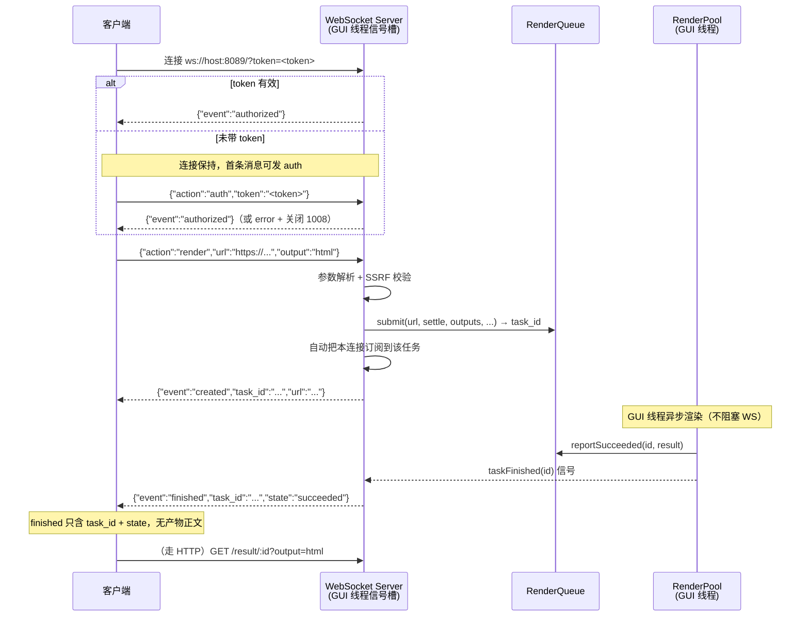
```mermaid
sequenceDiagram
    participant C as 客户端
    participant WS as WebSocket Server<br/>(GUI 线程信号槽)
    participant Q as RenderQueue
    participant P as RenderPool<br/>(GUI 线程)

    C->>WS: 连接 ws://host:8089/?token=<token>
    alt token 有效
        WS-->>C: {"event":"authorized"}
    else 未带 token
        Note over C,WS: 连接保持，首条消息可发 auth
        C->>WS: {"action":"auth","token":"<token>"}
        WS-->>C: {"event":"authorized"}（或 error + 关闭 1008）
    end
    C->>WS: {"action":"render","url":"https://...","output":"html"}
    WS->>WS: 参数解析 + SSRF 校验
    WS->>Q: submit(url, settle, outputs, ...) → task_id
    WS->>WS: 自动把本连接订阅到该任务
    WS-->>C: {"event":"created","task_id":"...","url":"..."}
    Note over P: GUI 线程异步渲染（不阻塞 WS）
    P->>Q: reportSucceeded(id, result)
    P-->>WS: taskFinished(id) 信号
    WS-->>C: {"event":"finished","task_id":"...","state":"succeeded"}
    Note over C: finished 只含 task_id + state，无产物正文
    C->>WS: （走 HTTP）GET /result/:id?output=html
```

**跨传输订阅：HTTP 提交 → WS 接收推送**：一个进程用 HTTP 提交，另一个进程用 WS 订阅同一 task_id。

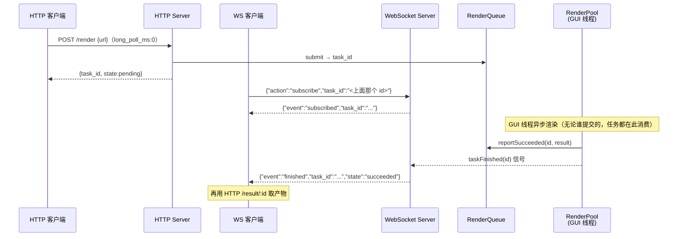
```mermaid
sequenceDiagram
    participant HC as HTTP 客户端
    participant H as HTTP Server
    participant WC as WS 客户端
    participant WS as WebSocket Server
    participant Q as RenderQueue
    participant P as RenderPool<br/>(GUI 线程)

    HC->>H: POST /render {url}（long_poll_ms:0）
    H->>Q: submit → task_id
    H-->>HC: {task_id, state:pending}
    WC->>WS: {"action":"subscribe","task_id":"<上面那个 id>"}
    WS-->>WC: {"event":"subscribed","task_id":"..."}
    Note over P: GUI 线程异步渲染（无论谁提交的，任务都在此消费）
    P->>Q: reportSucceeded(id, result)
    P-->>WS: taskFinished(id) 信号
    WS-->>WC: {"event":"finished","task_id":"...","state":"succeeded"}
    Note over WC: 再用 HTTP /result/:id 取产物
```

## License

本项目（seimi-render 自有源码，位于 [`src/`](./src/)、[`scripts/`](./scripts/)、[`chrome-extension/`](./chrome-extension/)）采用 **Apache License 2.0** 开源，版权所有 © 2026 [wanghaomiao.cn](mailto:et.tw@163.com)。协议全文见 [`LICENSE`](./LICENSE)，归属声明见 [`NOTICE`](./NOTICE)。

### 第三方依赖

本项目使用以下第三方组件，其许可协议各自独立、版权声明保留在对应源文件中：

| 依赖 | 用途 | 协议 |
|------|------|------|
| [Qt 6](https://www.qt.io/)（Qt WebEngine / Network / WebSockets 等） | Chromium 渲染核心、网络栈 | **LGPL v3**（开源选项）/ 商业双授权 |
| [cpp-mcp](./third_party/cpp-mcp/) | MCP 协议实现 | MIT |
| [cpp-httplib](./third_party/httplib.h) | HTTP 服务 | MIT |
| [html2md](./third_party/html2md.cpp) / [table](./third_party/table.cpp) | HTML→Markdown 转换 | MIT |
| [qaes](./third_party/qaes/) | AES 加密 | Public Domain |
| [Mozilla Readability](./third_party/readability/) | 正文提取 | Apache License 2.0 |


