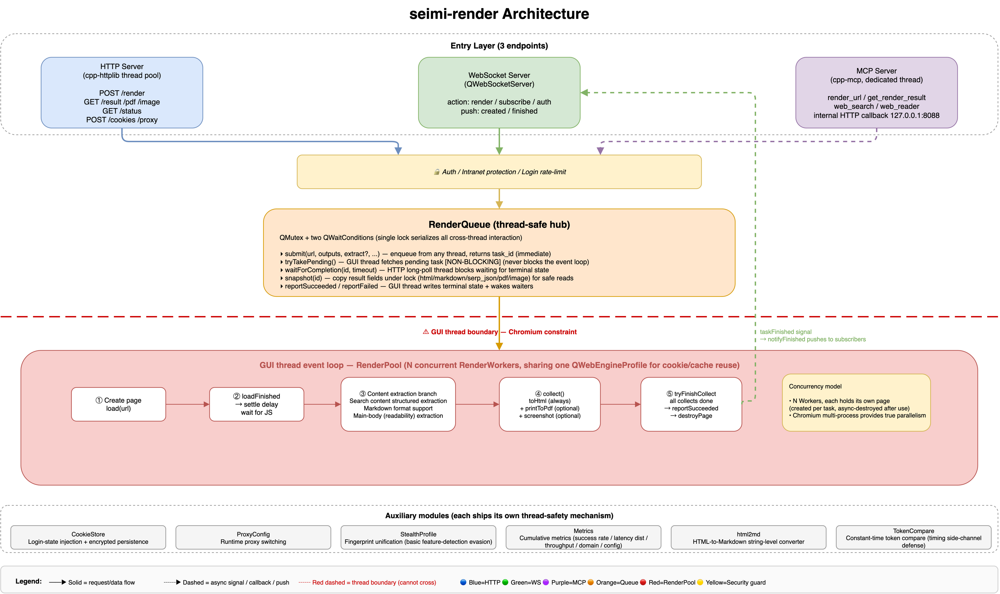
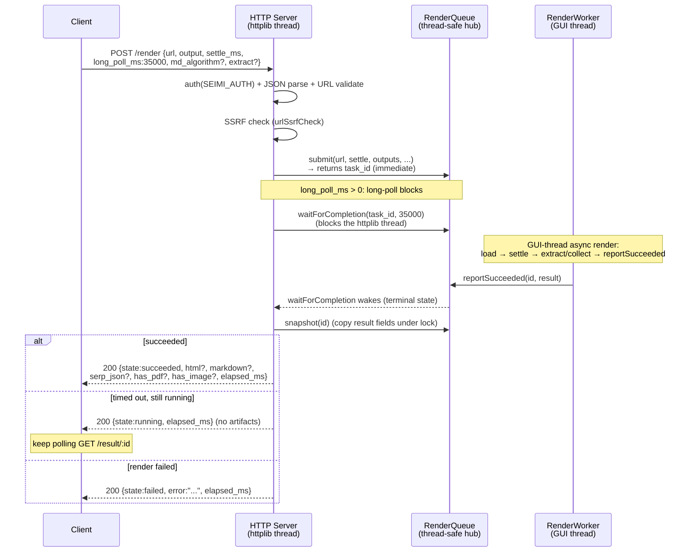
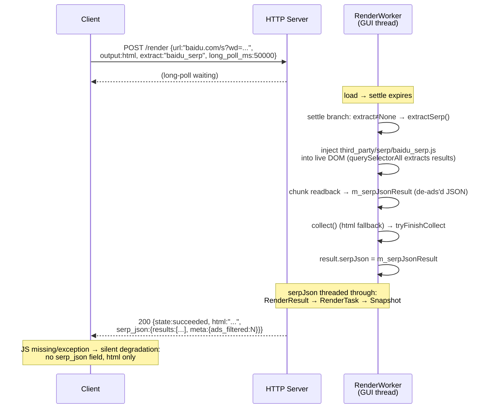
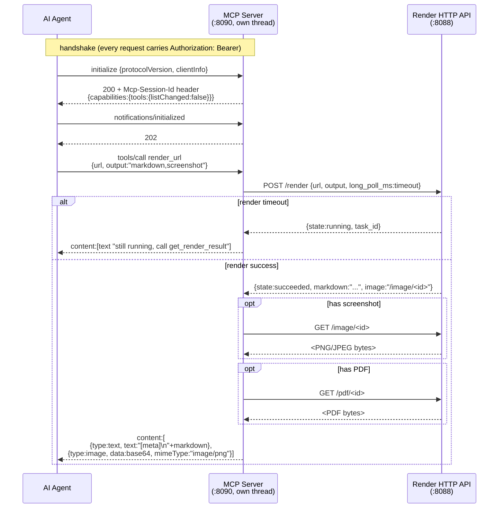
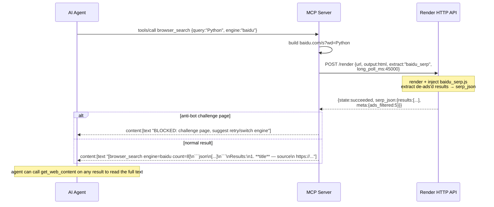
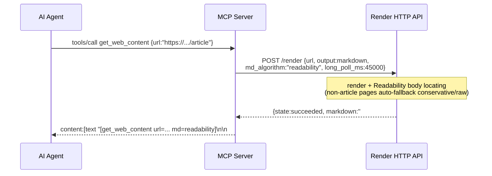
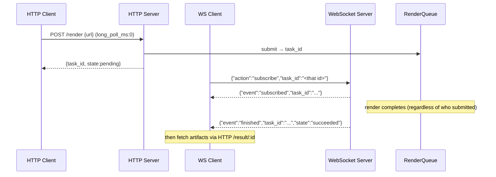

# seimi-render

> 📖 **Documentation languages:** [简体中文](../README.md) | **English**

A Chromium-based web rendering service. Submit a URL and seimi-render loads the page with a real Chromium browser (executing JS, waiting for async content), then returns the fully rendered HTML, PDF, PNG, or structured JSON search results. Results can be fetched via long polling or WebSocket push. Runs silently in the background. Supports the MCP protocol, making it a perfect fit for AI agent tools — extending your harness's data-acquisition reach.

This project is the modern successor to [SeimiAgent](https://github.com/zhegexiaohuozi/SeimiAgent).

## Features

- **Real browser rendering** — Built on QtWebEngine (Chromium); supports JS rendering (Ajax), SPAs, and dynamic content.
- **HTTP API** — Remote admin UI; submit tasks, query status, and long-poll for results (html / markdown / pdf / image).
- **WebSocket push** — Real-time notification when rendering completes, so you can freely compose any workflow.
- **MCP protocol support** — Built-in MCP server (port 8090); ZCode / Codex / Claude Code / Cursor and other agents can plug in directly to drive rendering. Unlimited web data reading or search-engine power for your agent.
- **Bundled Chrome extension** — Syncs cookie state 1:1 with your own Chrome, so agents and other automation scenarios quickly inherit and keep a consistent login state.
- **Login-state persistence** — Cookies are encrypted to disk (`data/cookies.dat`) and automatically restored on service restart, so you don't have to re-sync.
- **Runtime proxy hot-swap** — `--proxy` / `POST /proxy` lets you change the upstream proxy at any time without restarting; you can extend this with your own proxy pool to fully dodge IP rate-limiting.
- **Built-in web admin console** — Monitoring dashboard, render test bench, cookie management, API docs, one-click Agent-config copy.
- **Structured search-engine result extraction** — Baidu / Bing / Google results are de-ads'd and structured into JSON.
- **Runtime metrics** — Success rate, latency percentiles (p50/p90/p99), throughput, per-domain distribution — fit for an ops dashboard.
- **Multiple render outputs** — html, markdown, pdf, png/jpg, and structured search-result JSON.
- **Headless** — Defaults to the offscreen platform; no display needed, won't disturb your local browser, and your local activity won't disturb result capture.
- **Basic anti-fingerprinting** — Baseline anti-bot-evasion capability.

## Architecture



## Build & Run

### Install dependencies

| Platform | Command |
|------|------|
| Windows | `scripts\setup-windows.bat` |
| Linux   | `sh scripts/setup-linux.sh` |
| macOS   | `sh scripts/setup-macos.sh` |

### Build & package

| Platform | Command |
|------|------|
| Windows | `scripts\package-windows.bat` |
| Linux   | `sh scripts/package-linux.sh` |
| macOS   | `sh scripts/package.sh` |

## Quick Start

Start the service (headless offscreen by default):

### macOS
```bash
build/seimi-render.app/Contents/MacOS/seimi-render --http-port 8088 --ws-port 8089
```

### Example: use with an AI tool
Standard, general-purpose MCP config:
```
{
  "mcpServers": {
    "seimi-render": {
      "type": "http",
      "url": "http://127.0.0.1:8090/mcp"
    }
  }
}
```
> Note: if you start the service with a password, you must add authorization info. You can copy it directly from the **Config Example** tab in the [admin console](#browser-graphical-remote-admin-console).

### Expected behavior with an AI tool

Once seimi-render is connected to an AI agent client over MCP, the agent can drive the whole pipeline — "render a page → extract the main text → structured analysis" — in natural language, without you writing URLs or parsing HTML. The table below shows a few real usage scenarios (screenshots from actual agent sessions). On top of seimi-render you can freely build any data-scraping and analysis workflow — stock sentiment, historical K-line analysis, and so on. These are simple demos; for complex tasks you can author a custom Skill that uses seimi-render as the data-acquisition backbone to build the closed-loop data workflow you want.

| Scenario | Description | Screenshot (click to enlarge) |
|------|------|:----------------:|
| **Natural-language-driven rendering** | In an agent client like ZCode, the user describes a need in one sentence (e.g. "I want to know which hospitals in Beijing are reliable for dental implants"). The agent plans and calls `mcp__seimi-render__browser_search`, waits synchronously for structured search results, and — if it decides more detail is needed — calls `get_web_content` to fetch the full page. | <a href="images/zcode-agent-usage.jpg" target="_blank"></a> |
| **Structured search output** | Calling `browser_search` returns structured search results, easy for the agent to process and understand. | <a href="images/zcode-agent-mcp-result.png" target="_blank"></a> |
| **Multi-step iteration** | For complex needs the agent breaks the task into steps: render the target page → read the structured result → render related pages or call search-engine extraction (Baidu/Bing/Google SERP) → synthesize the output. The image shows a full chain of multiple MCP tool calls + intermediate reasoning within a single session. | <a href="images/zcode-agent-usage-c2.jpg" target="_blank"></a> |

> How to connect is described in [Example: use with an AI tool](#example-use-with-an-ai-tool) above; the config JSON can be one-click copied from the **Config Example** tab in the admin console. The `mcp__seimi-render__*` tool names in the screenshots correspond to the `render_url` / `get_render_result` tools exposed by [`McpServer`](../src/McpServer.cpp) (see the MCP group under the [API docs](#browser-graphical-remote-admin-console) tab).

### Manual integration / build your own client

One command to render `https://www.sohu.com/` and get the HTML (submit + long-poll combined):

```bash
curl -X POST http://localhost:8088/render \
  -H "Content-Type: application/json" \
  -d '{"url":"https://www.sohu.com/","settle_ms":2500,"long_poll_ms":35000}'
```

Response (formatted, HTML abbreviated):

```json
{
  "task_id": "a3f1...",
  "url": "https://www.sohu.com/",
  "state": "succeeded",
  "elapsed_ms": 8550,
  "html": "<!DOCTYPE html><html lang=\"zh-CN\"><head><title>搜狐</title>..."
}
```

Measured: rendering the Sohu homepage (`https://www.sohu.com/`) took **~8.5s**, returned **~220KB** of HTML with 44 `<script>` tags and 406 links, title "搜狐" — i.e. the full DOM after Chromium finished executing JS.

## Command-line arguments

| Argument | Default | Description |
|------|--------|------|
| `--http-port <n>` | `8088` | HTTP service port |
| `--ws-port <n>` | `8089` | WebSocket service port |
| `--mcp-port <n>` | `8090` | MCP (Model Context Protocol) HTTP port, for Claude Code / Cursor and other agents |
| `--host <addr>` | `127.0.0.1` | Bind address; use `0.0.0.0` to expose externally |
| `--concurrency <n>` | `3` | Number of WebEngine render slots (see [Concurrency & throughput](#concurrency--throughput---concurrency)) |
| `--http-threads <n>` | `8` | HTTP worker thread count |
| `--settle-ms <n>` | `2000` | Default JS settle delay, ms to wait for JS execution after `loadFinished` (0–30000) |
| `--load-timeout-ms <n>` | `20000` | Total per-task timeout (ms) |
| `--windowed` | offscreen | Force a native-window QPA platform; offscreen headless mode is the default |
| `--no-sandbox` | off | Disable the Chromium sandbox; often needed under WSL2 / containers / root |
| `--sandbox` | off | Force-enable the Chromium sandbox (overrides the root auto-detection) |
| `--verbose-chromium` | off | Show Chromium / web-console logs (known noise is filtered by default) |
| `--password <pw>` | — | Admin password. (Insecure: visible in plaintext via `ps`/process lists; the two options below are preferred) |
| `--password-file <f>` | — | Read the password from the first line of a file (recommended) |
| `SEIMI_PASSWORD` env var | — | Read the password from the environment variable (recommended). Priority: `--password` > `--password-file` > `SEIMI_PASSWORD`. Unset = no password, open access |
| `--no-admin` | off (admin on) | Disable the built-in admin UI; by default `GET /` serves the console |
| `--trusted-proxy <list>` | — | Comma-separated trusted reverse-proxy IPs/CIDRs (e.g. `10.8.0.0/16,127.0.0.1`). When set, `/api/login` rate-limiting is based on the real client IP extracted from `X-Forwarded-For`; otherwise the TCP peer address is used (XFF ignored, to prevent spoofing) |
| `--proxy <url>` | — | Upstream proxy for all Chromium traffic. Format `http://[user:pass@]host:port` or `socks5://[user:pass@]host:port`. Set via `QNetworkProxy::setApplicationProxy`; supports runtime `POST /proxy` hot-swap without restart. `type=direct` clears it |
| `--no-stealth` | off (stealth on) | Disable browser fingerprint unification. Stealth is on by default, disguising every render instance as the same Chrome desktop environment (UA/screen/WebGL/canvas) to blend into the crowd and evade basic anti-bot detection (e.g. Google) |
| `--help` | — | Show help |

### Concurrency & throughput (`--concurrency`)

`--concurrency` is the core throughput knob: each render slot is an independent `QWebEnginePage` sharing a single GUI-thread event loop, with real CPU/network parallelism provided by Chromium's internal multi-process model. **More slots = more concurrent tasks = higher overall throughput** — up to an inflection point.

Measured data (link pool of 80 media articles — 20 each from Sohu/NetEase/Sina/The Paper, 16-core / 32-thread machine, 2 minutes per level):

| `--concurrency` | Throughput (req/s) | Relative gain | p50 (ms) | p99 (ms) | Success rate |
|----------------:|:------------:|:--------:|:--------:|:--------:|:------:|
| 2 | 0.31 | baseline | 6125 | 9497 | 100% |
| 4 | 0.64 | +106% | 6012 | 8322 | 100% |
| 8 | 1.24 | +300% | 5984 | 8857 | 100% |
| 12 | 1.30 | +319% | 8697 | 12265 | 100% |
| 16 | 1.29 | +316% | 11757 | 17356 | 100% |
| 20 | 1.29 | +316% | 14460 | 18538 | 100% |

## Browser-graphical remote admin console

seimi-render ships with a browser-based admin console (`GET /` — open the root path). It bundles "view runtime status, test rendering, manage cookies, configure Agent access, browse API docs" into one web UI — usable locally or remotely, no SSH needed to curl on the server. **On by default**; `--no-admin` disables it. Supports authentication.

See the table below for each console tab:

| Tab | Purpose | Screenshot (click to enlarge) |
|--------|------|:----------------:|
| **Runtime stats** | Monitoring dashboard: uptime, total requests/success/fail/success-rate, throughput (req/s), latency distribution (min/avg/p50/p90/p99/max), output-type demand, per-domain request volume & success rate Top-N, queue snapshot. Good for capacity planning and locating high-failure-rate sites. | <a href="images/runtime-info.png" target="_blank"></a> |
| **Render test bench** (Chinese) | Core debugging tool: enter a URL, tune settle_ms / long-poll, pick output formats (HTML/Markdown/PDF/screenshot), choose screenshot encoding and markdown algorithm, **site-specific extraction** (Baidu/Bing/Google SERP). The image shows Bing search results yielding 10 de-ads'd results. | <a href="images/bing-search-render.png" target="_blank"></a> |
| **Render test bench** (English) | The same UI switched to English (top-right "中" toggles back to Chinese), demonstrating Google structured extraction (`extract=google_serp`). A direct way to verify that stealth fingerprint unification + prefetch downgrade are working. | <a href="images/google-search-extract-en.png" target="_blank"></a> |
| **Cookie status** | View the login-state cookies the render service holds, shown per-domain as "cookie count carried" (no values, to prevent leakage), to reconcile with the browser extension. "Clear current session" / "Permanently delete" clear in-memory session cookies and the encrypted persistent store (`data/cookies.dat`) respectively. | <a href="images/cookies.png" target="_blank"></a> |
| **Config example** | One-click copy of Agent integration & invocation config: the `mcpServers` JSON for Claude Code / Cursor, a curl-to-`/render` example, a WebSocket example, and the current access token (shown when `--password` is enabled). | <a href="images/config-show.png" target="_blank"></a> |
| **API docs** | Interactive API docs: the left tree groups by "HTTP REST / MCP tools / WebSocket" (16 HTTP endpoints + 4 MCP tools + WS render/subscribe/auth); the right pane has parameter tables, curl/JSON examples, response examples and error codes, all one-click copyable. | <a href="images/api-docs.png" target="_blank"></a> |

> Cookie sync source: see [Browser extension](#browser-extension) below. The admin UI is pure static assets ([`admin-ui/`](../admin-ui/)), bundled with the binary, no external service needed. Remote access requires an explicit `--host 0.0.0.0` and strongly recommends configuring `--password` (the admin UI can change the proxy and inject cookies — it's a high-privilege entry point).

## Browser extension

seimi-render renders with a clean Chromium profile by default, carrying none of your login state. To render "login-gated" pages (personal dashboards, paid content, internal systems, login-required search results, etc.), first sync your browser's login cookies over. The bundled **Chrome extension** ([`chrome-extension/`](../chrome-extension/)) does this in one click.


The extension reads **all** of the browser's cookies, aggregates them by domain, and after you check the ones you want, POSTs them in one click to seimi-render's `/cookies` endpoint. From then on, Chromium automatically carries the login state when rendering pages on those domains.

### Install (load in developer mode)

1. Start the seimi-render service (default `http://localhost:8088`).
2. Open `chrome://extensions` in Chrome → toggle **Developer mode** on (top right).
3. Click **Load unpacked** → select the [`chrome-extension/`](../chrome-extension/) directory.
4. A seimi-render icon appears in the toolbar — click to use.

> Works on Chromium-based browsers (Chrome / Edge / Brave, MV3). Firefox uses different API names and needs its own adaptation.

### Usage demo

1. **Click the toolbar icon** → the popup auto-reads all browser cookies and shows them aggregated by domain.
   - At the top, confirm the seimi-render endpoint (default `http://localhost:8088`, remembered); if `--password` is set, enter the corresponding token under "access token".
   - The top-right badge shows connection status (green "connected" / "not connected" / "checking"), confirming the extension can reach the service.
2. **Filter domains to sync:**
   - "Select all" at the top toggles all on/off.
   - The search box filters by keyword (locates a domain in seconds even among hundreds).
   - The list is sorted by cookie count descending — heavy-login-state sites rank first (e.g. in the screenshot `jd.com 23`, `aliyun.com 22`).
   - All are selected by default; it's recommended to **check only the domains you need** (don't pour sensitive sessions like banking/email in).
3. **Click the blue "Sync (N)" button** → the extension POSTs the selected domains' cookies in bulk to `/cookies`, then auto-reconciles, showing "synced N cookies (server has M total)" — N==M means success.
4. From then on seimi-render auto-carries the login state when rendering pages on those domains.

> The "Clear server" button = one-click `DELETE /cookies` to wipe the synced cookies on seimi-render (handy when switching accounts / debugging).

### View server-side synced cookies

After syncing, you can view the cookies the render service currently holds on the **Cookie status** page of the admin console (`GET /`):


- The table shows "COOKIE count carried" per domain, to reconcile with the extension.
- Top-right "Clear current session" / "Permanently delete" clear in-memory session cookies and the persistent store respectively.
- The page notes that **cookies are encrypted to `data/cookies.dat`** and auto-restored on restart — so after syncing once, a restart needs no re-sync.

> **Privacy**: the extension only reads cookie plaintext and stores nothing else; the `GET /cookies` overview returns only "domain → count" with no cookie value, to prevent session leakage; cookies are encrypted at rest, the key derived via PBKDF2 from a compile-time pepper + machine-bound salt (`data/seimi.key`), and becomes invalid on a different machine. See [`chrome-extension/README.md`](../chrome-extension/README.md).

## HTTP API

| Method | Path | Description |
|------|------|------|
| GET  | `/` | Admin UI |
| POST | `/render` | Submit a render task (can carry `long_poll_ms` to synchronously wait for the result) |
| GET  | `/status/:id` | Query a single task's status (non-blocking) |
| GET  | `/status` | Runtime panorama: cumulative counts, success rate, latency distribution, throughput, per-domain distribution, queue snapshot |
| GET  | `/result/:id?timeout=N` | Long-poll to fetch HTML (default 25s) |
| POST | `/cookies` | Sync browser login-state cookies (used by the extension) |
| GET  | `/cookies` | Overview of synced cookies (domain → count, no values) |
| DELETE | `/cookies` | Clear all synced cookies |
| GET  | `/stats` | Queue stats (simple snapshot, backward compat) |

### Response fields

| Field | Description |
|------|------|
| `task_id` | Task ID (16 hex chars) |
| `url` | The submitted URL |
| `state` | `pending` / `running` / `succeeded` / `failed` |
| `html` | The fully rendered HTML (present only on `succeeded`) |
| `error` | Failure reason (present only on `failed`) |
| `elapsed_ms` | Elapsed time from render start to now (ms) |

### Submit a task (async)

Returns `pending` immediately; poll yourself or use WebSocket to wait for the result:

```bash
curl -X POST http://localhost:8088/render \
  -H "Content-Type: application/json" \
  -d '{"url":"https://www.sohu.com/","settle_ms":2500}'
# => {"task_id":"a3f1...","url":"https://www.sohu.com/","state":"pending"}
```

With long polling (blocks after submit until complete or timeout, fetching the result in one step):

```bash
curl -X POST http://localhost:8088/render \
  -H "Content-Type: application/json" \
  -d '{"url":"https://www.sohu.com/","settle_ms":2500,"long_poll_ms":35000}'
# succeeded => {"task_id":"...","state":"succeeded","html":"...","elapsed_ms":8550}
# timed out, still running => {"task_id":"...","state":"running","elapsed_ms":35000}
```

Request parameters:
- `url` (required): an http/https address
- `settle_ms` (optional, default 2000): ms to wait for JS execution after `loadFinished` (0–30000); for content-heavy pages like Sohu, 2500+ is recommended
- `long_poll_ms` (optional, default 0): ms to long-poll for the result (>0 blocks until complete or timeout, max 60000)

### Query status

```bash
curl http://localhost:8088/status/a3f1...
# => {"task_id":"a3f1...","url":"https://www.sohu.com/","state":"running","elapsed_ms":1203}
```

### Long-poll for HTML

Suited to "submit async first, come back later for the result":

```bash
curl "http://localhost:8088/result/a3f1...?timeout=30000"
# complete: {"task_id":"...","state":"succeeded","html":"<!DOCTYPE html>...","elapsed_ms":8550}
# timed out, still running: {"task_id":"...","state":"running","elapsed_ms":30000}
# failed: {"task_id":"...","state":"failed","error":"...","elapsed_ms":...}
```

### Runtime status (`GET /status`)

Global ops view: cumulative counts since start, success rate, render latency distribution (min/avg/p50/p90/p99/max), throughput, output-type demand distribution, **per-domain request volume**, and the current queue snapshot. Good for a monitoring dashboard, capacity planning, and locating high-failure-rate site categories.

```bash
curl http://localhost:8088/status
# optional ?domains=N controls how many domain rows are returned (default 20, max 200):
curl 'http://localhost:8088/status?domains=50'
```

Response (formatted):

```json
{
  "started_at_ms": 1781876333526,
  "uptime_ms": 1300620,
  "uptime_human": "00:21:40",
  "queue": {
    "total": 2, "pending": 0, "running": 1, "done": 1
  },
  "totals": {
    "requests": 1280, "succeeded": 1244, "failed": 36, "success_rate": 0.972
  },
  "latency_ms": {
    "min": 980, "avg": 5230.4, "p50": 4120, "p90": 8910, "p99": 15630, "max": 28010
  },
  "throughput_per_sec": 0.985,
  "outputs": { "html": 320, "markdown": 940, "pdf": 20 },
  "domains": {
    "distinct": 87,
    "top": [
      { "host": "www.sohu.com",   "total": 600, "succeeded": 598, "failed": 2,   "success_rate": 0.997 },
      { "host": "example.com",    "total": 410, "succeeded": 385, "failed": 25,  "success_rate": 0.939 }
    ]
  }
}
```

Field descriptions:

| Field | Description |
|------|------|
| `started_at_ms` / `uptime_ms` / `uptime_human` | Start time, uptime (ms and human-readable) |
| `queue` | Live queue snapshot (same as `/stats`) |
| `totals.requests/succeeded/failed` | Cumulative terminal-state counts since start |
| `totals.success_rate` | `succeeded / requests`, 0–1 |
| `latency_ms` | Render-time distribution for **successful tasks only**; failures excluded. p50/p90/p99 approximated via a log-bucket histogram (fixed memory, no per-sample storage) |
| `throughput_per_sec` | `requests / uptime(seconds)` |
| `outputs.html/markdown/pdf` | How many times each output type was requested (bit-flag counting) |
| `domains.distinct` | Total distinct hosts seen |
| `domains.top[]` | Top-N domains by `total` descending, each with succeeded/failed/success_rate |

> **Resource cost**: metrics are updated exactly once when a task reaches a terminal state (success/failure), never on the hot path; latency uses a fixed 32-bucket histogram (O(1) memory, O(1) update); the domain map is capped at 1000 hosts, evicting the coldest when exceeded, to stop the host map from growing unbounded under hostile/crawler scenarios. `GET /status` locks once to copy the snapshot; the top-N sort runs only over the returned N rows, negligible cost.

### Parsing the render result (Python example)

```python
import requests, json

# submit + long-poll in one step
r = requests.post("http://localhost:8088/render", json={
    "url": "https://www.sohu.com/",
    "settle_ms": 2500,
    "long_poll_ms": 35000,
}).json()

if r["state"] == "succeeded":
    html = r["html"]
    print("HTML length:", len(html))
    import re
    title = re.search(r"<title>(.*?)</title>", html, re.S)
    print("title:", title.group(1).strip() if title else "(none)")
    print("link count:", html.lower().count("href"))
```

Output:
```
HTML length: 221576
title: 搜狐
link count: 406
```

### Interaction sequence diagrams

**Submit render (long-poll, fetch result in one step — most common)**: the client submits with `long_poll_ms` and the server blocks until rendering completes (or times out) before returning.



**Async submit + later fetch (large files / screenshots / PDF)**: `long_poll_ms:0` returns `pending` immediately; fetch artifacts later on demand.

```mermaid
sequenceDiagram
    participant C as Client
    participant H as HTTP Server
    participant Q as RenderQueue

    C->>H: POST /render {url, output:"html,pdf,screenshot",<br/>long_poll_ms:0}
    H->>Q: submit(...) → task_id
    H-->>C: 200 {task_id, state:pending, elapsed_ms:0}
    Note over C: non-blocking, do other things
    C->>H: GET /status/:id (lightweight, no artifacts)
    H->>Q: snapshot(id)
    H-->>C: {state:running, elapsed_ms} / {state:succeeded}
    C->>H: GET /result/:id?output=html&timeout=25000 (long-poll HTML)
    H->>Q: waitForCompletion + snapshot
    H-->>C: {state:succeeded, html:"..."}
    C->>H: GET /pdf/:id (fetch PDF binary)
    H-->>C: application/pdf (or 404 not requested / 409 not done)
    C->>H: GET /image/:id (fetch screenshot binary)
    H-->>C: image/png | image/jpeg (or 404 / 409)
```



**Search-engine structured extraction (`extract=baidu_serp/bing_serp/google_serp`)**: same path as a normal render; after settle it takes the SERP-extraction branch, and the response gains a `serp_json` field.



## MCP (for Claude Code / Cursor and other agents)

seimi-render ships with an **MCP (Model Context Protocol) server** (default port `8090`, based on [hkr04/cpp-mcp](https://github.com/hkr04/cpp-mcp), Streamable HTTP transport, compliant with the 2025-03-26 spec). This lets AI agent tools like Claude Code and Cursor **treat seimi-render directly as a rendering tool** — the agent autonomously decides when to render a page and grab the rendered content.

### Exposed tools

4 tools total, ordered by "semantic level" from high to low — the agent prefers high-level tools, with the low-level `render_url` catching everything they don't cover:

| tool | Purpose | Required params | Optional params |
|------|------|----------|----------|
| `browser_search` | Keyword search: builds a search-engine URL and renders it, returning a result list. **Preferred when no URL is given and the user just wants to "search / look up".** | `query` | `engine` (google/bing/baidu/duckduckgo, default google), `settle_ms` (2500), `timeout_ms` (45000) |
| `get_web_content` | Read a single article body: uses readability to extract clean markdown (stripping nav/ads/sidebar). **Preferred when a specific URL is given to read in full.** | `url` | `md_algorithm` (readability/conservative, default readability), `settle_ms` (2500), `timeout_ms` (45000) |
| `render_url` | Full-featured renderer: any URL, any output combo. **Use when you need PDF/screenshot/raw HTML / a hand-specified search-engine URL / a custom settle.** | `url` | `output` (markdown/html/pdf/screenshot comma combo, default markdown), `md_algorithm` (conservative/readability, default conservative), `format` (auto/png/jpg, screenshot only), `settle_ms` (2500), `timeout_ms` (45000) |
| `get_render_result` | Fetch the result of an already-submitted task by task_id: poll after `render_url` times out returning `running`, or re-fetch a finished artifact. | `task_id` | `output` (markdown/html/screenshot/pdf, default markdown), `timeout_ms` (5000) |

**Tool-selection cheat sheet** (also written into each tool's description; the agent decides automatically):

- User says "search / look up / Google it / help me find out…" but gives no URL → `browser_search`
- User gives an article/page URL to read the body → `get_web_content`
- Need PDF / screenshot / raw HTML / conservative markdown / hand-built search URL / custom settle → `render_url`
- Previous step returned `state=running` (slow site / anti-bot didn't finish) → `get_render_result` to poll

**Output formats** (`render_url`'s `output` param):

| Value | Return form |
|----|----------|
| `markdown` (default) | MCP text content, clean readable text |
| `html` | MCP text content, the full rendered HTML |
| `pdf` | Pull `/pdf/<id>` binary → base64-encode as text content (agent decodes and saves .pdf) |
| `screenshot` | Pull `/image/<id>` binary → native MCP **image content** (base64 + mimeType, agent can display the image directly) |

Comma combos are supported (e.g. `markdown,screenshot`): text first, screenshot as image content after, PDF as base64 text appended at the end.

> **`browser_search` engine differences**: `baidu`/`bing`/`google` go through structured SERP extraction (`extract=baidu_serp` etc.), returning a de-ads'd JSON result array (each entry has title/url/snippet/source, plus "related searches"); `duckduckgo` returns a full-page conservative markdown (may include ads). On hitting an anti-bot challenge page it returns a `BLOCKED` notice and suggests switching engine / retrying.

Internally the tools call the render API over loopback HTTP (`127.0.0.1:8088`), reusing the existing thread-safe render chain — the MCP server **never touches WebEngine directly**.

### Auth (when `--password` is enabled)

When seimi-render is started with a password (`--password` / `--password-file` / `SEIMI_PASSWORD`), the MCP endpoint (`:8090`) is equally protected: every request must carry `Authorization: Bearer <token>`, the token **shared with HTTP/WS as one deterministic token** (derived by `HttpServer::computeToken`). The MCP server runs on its own thread and validates the token with a constant-time compare (to defeat timing side-channels).

Each agent client carries the token via a request header (the exact field name depends on the client; most support custom headers):

```json
{
  "mcpServers": {
    "seimi-render": {
      "type": "http",
      "url": "http://localhost:8090/mcp",
      "headers": {
        "Authorization": "Bearer <your token>"
      }
    }
  }
}
```

> Not needed when no password is set (MCP binds to `127.0.0.1` by default, not exposed to the public internet).

### Claude Code setup

Add this to Claude Code's config (`~/.claude.json` or project `.mcp.json`):

```json
{
  "mcpServers": {
    "seimi-render": {
      "type": "http",
      "url": "http://localhost:8090/mcp"
    }
  }
}
```

Make sure seimi-render is running (`./build/seimi-render.app/Contents/MacOS/seimi-render`). Once connected, you can just tell Claude Code "render https://www.sohu.com/ and give me the markdown" and Claude will call the `render_url` tool automatically.

### Cursor setup

Cursor → Settings → MCP → Add new MCP server:

```json
{
  "mcpServers": {
    "seimi-render": {
      "url": "http://localhost:8090/mcp"
    }
  }
}
```

### Startup arguments

```bash
# default MCP port 8090
./seimi-render --mcp-port 8090

# custom
./seimi-render --http-port 8088 --mcp-port 9090
```

### Manually verifying the MCP endpoint

MCP is a stateful session protocol (initialize → initialized notification → tools/list). Full flow example (Streamable HTTP):

```bash
# 1. initialize, grab the session id
SID=$(curl -s -D - -X POST http://localhost:8090/mcp \
  -H "Content-Type: application/json" \
  -H "Accept: application/json, text/event-stream" \
  -d '{"jsonrpc":"2.0","id":1,"method":"initialize","params":{"protocolVersion":"2025-03-26","capabilities":{},"clientInfo":{"name":"probe","version":"1"}}}' \
  | grep -i "^mcp-session-id:" | sed 's/.*: //I' | tr -d '\r\n')

# 2. send the initialized notification (required, or the session isn't ready)
curl -X POST http://localhost:8090/mcp \
  -H "Content-Type: application/json" -H "Accept: application/json, text/event-stream" \
  -H "Mcp-Session-Id: $SID" \
  -d '{"jsonrpc":"2.0","method":"notifications/initialized"}'

# 3. list tools
curl -X POST http://localhost:8090/mcp \
  -H "Content-Type: application/json" -H "Accept: application/json, text/event-stream" \
  -H "Mcp-Session-Id: $SID" \
  -d '{"jsonrpc":"2.0","id":2,"method":"tools/list"}'

# 4. call render_url
curl -X POST http://localhost:8090/mcp \
  -H "Content-Type: application/json" -H "Accept: application/json, text/event-stream" \
  -H "Mcp-Session-Id: $SID" \
  -d '{"jsonrpc":"2.0","id":3,"method":"tools/call","params":{"name":"render_url","arguments":{"url":"https://www.sohu.com/"}}}'
```

> Recommended: use the [MCP Inspector](https://github.com/modelcontextprotocol/inspector) (`npx @modelcontextprotocol/inspector`) for visual debugging — set the URL to `http://localhost:8090/mcp`; it handles the handshake/session automatically and lets you click through tool calls.

### Implementation notes

- The MCP library (cpp-mcp) bundles its own copy of cpp-httplib, differing from the project's version. To avoid an ODR clash (two different versions of a header-only library in one process crashing at runtime), the build **unifies on the project's httplib** — see the isolated include-path design for the `seimi-mcp` target in `CMakeLists.txt`.
- The MCP server runs on its own thread (non-blocking mode; cpp-mcp manages its own server + maintenance threads). The HTTP render service (8088) and WebSocket (8089) work independently; the three don't affect each other. If the MCP port fails to come up, it only logs a warning and the main render functionality is unaffected.
- **Session capacity & reaping**: `max_sessions=64` (headroom for multi-agent concurrency), `session_timeout=3600` (the maintenance thread reaps sessions idle > 1h every 10s). cpp-mcp has been patched to "auto-rebuild expired sessions" — a client calling a tool with any session id succeeds and reuses that id in place, so session config only affects memory buildup, not availability. The non-blocking `start(false)` must be used to start the maintenance thread, otherwise sessions only grow and new connections 503 forever once full.
- **Auth patch**: when a password is enabled, cpp-mcp upstream's `set_auth_handler` is an empty stub; the forked `mcp_server.cpp` adds `enforce_auth_` enforcement, handler signature `(token, path) -> bool`.
- MCP port binding matches the main service: when `--host` isn't given explicitly it's **force-pinned to loopback** (`127.0.0.1`) to avoid accidentally opening to the public internet; set `--host 0.0.0.0` explicitly for remote access.

### Interaction sequence diagrams

MCP tools **never touch WebEngine directly**; instead they call the loopback render HTTP API (`127.0.0.1:8088`) via an httplib client, then assemble the result into MCP content (text/image) for the agent.

**Handshake + `render_url` (render and fetch result)**:



**`browser_search` (keyword search + structured extraction)**: baidu/bing/google take the `extract` structured path, returning a de-ads'd JSON result.



**`get_web_content` (read a single article body)**: single URL → readability body extraction, returns clean markdown.



## Cookie sync (rendering login-gated pages)

seimi-render renders with a clean WebEngine profile by default, carrying no login state. To render "login-gated" pages (personal dashboards, paid content, etc.), first sync your browser's login cookies over. The bundled **Chrome extension** (`chrome-extension/`) syncs them in one click.

### Chrome extension one-click sync (recommended)

```bash
# 1. start seimi-render first
./build/seimi-render --http-port 8088 --ws-port 8089
```

1. Open `chrome://extensions` in Chrome → enable **Developer mode** → **Load unpacked** → select the `chrome-extension/` directory.
2. Click the seimi-render toolbar icon; the popup auto-reads all browser cookies, aggregated by domain (all selected by default).
3. Check the domains to sync (supports select-all / search filter), click **Sync**.
4. After syncing it auto-reconciles, showing "synced N cookies (server has M total)".

From then on, rendering pages on those domains auto-carries the login state. Details in [`chrome-extension/README.md`](../chrome-extension/README.md).

### HTTP endpoint

You can also skip the extension and call the endpoint directly (e.g. to sync from another tool / script):

```bash
# bulk-sync cookies (fields map to Chrome cookies.getAll() output)
curl -X POST http://localhost:8088/cookies \
  -H "Content-Type: application/json" \
  -d '{"cookies":[
    {"name":"sid","value":"abc","domain":".example.com","hostOnly":false,
     "secure":true,"httpOnly":true,"path":"/","expirationDate":1893456000},
    {"name":"token","value":"xyz","domain":"example.org","hostOnly":true}
  ]}'
# => {"stored":2,"applied":true}

# overview (domain → count, no values, to prevent session leakage)
curl http://localhost:8088/cookies
# => {"total":2,"domains":[{"domain":"example.org","count":1},{"domain":".example.com","count":1}]}

# clear
curl -X DELETE http://localhost:8088/cookies
# => {"cleared":true}
```

Field descriptions:

| Field | Description |
|------|------|
| `name` / `value` | Required |
| `domain` | The domain; when `hostOnly=true` it's used as the origin host with no setDomain (exact host match) |
| `hostOnly` | true = exact host only (no subdomains), false = includes subdomains (domain auto-gets a leading dot) |
| `secure` / `httpOnly` | Map directly to the cookie attributes |
| `path` | Defaults to `/` |
| `expirationDate` | Epoch seconds; ≤0 is treated as a session cookie (lives with the process) |

> **Security**: cookies live only in memory (`NoPersistentCookies`), not on disk; a service restart clears them and you must re-sync. `GET /cookies` returns only domain counts, no values. Syncing goes over loopback HTTP (localhost by default), cookies never leave the machine.

## WebSocket push

Suited to "submit async, server proactively notifies on completion" scenarios — avoiding client-side empty polling. WebSocket supports two actions and you can do everything over a single connection:

- **`render`**: send a render request directly (submit a URL); the server acknowledges with `created` and pushes `finished` when rendering completes.
- **`subscribe`**: subscribe to an existing task (usually created by another `render` message or by HTTP `/render`); get a `finished` push on completion.

After receiving `finished`, fetch the HTML via HTTP `/result/:id`. Typical full WS flow:

```
client → {"action":"render","url":"https://www.sohu.com/","settle_ms":2500}
server ← {"event":"created","task_id":"..."}      # accepted
server ← {"event":"finished","task_id":"...","state":"succeeded"}  # done
```

### Message format

Connect to `ws://localhost:8089/` (text frames, JSON encoded). The model is **request-response + server push**: the client sends a request, the server replies with an ack, then proactively pushes when the task completes. WebSocket supports two actions — **send a render request directly** (`render`) and **subscribe to an existing task** (`subscribe`); a client can do "submit → wait for completion" over a single WS connection.

#### Client → Server: two actions

**① `render` — submit a render request** (recommended; one connection handles submit + result)

| Field | Type | Required | Description |
|------|------|------|------|
| `action` | string | yes | fixed `"render"` |
| `url` | string | yes | an http/https address |
| `settle_ms` | int | no | ms to wait for JS execution after loadFinished (0–30000, default 2000) |

On receipt the server submits a task to the render queue, **auto-subscribes this connection to it**, and immediately replies `created`; on completion it pushes `finished`. Real example:

```json
{"action":"render","url":"https://www.sohu.com/","settle_ms":2500}
```

**② `subscribe` — subscribe to an existing task** (the task is usually created by HTTP `/render` or another `render` message)

| Field | Type | Required | Description |
|------|------|------|------|
| `action` | string | yes | fixed `"subscribe"` |
| `task_id` | string | yes | the task ID to subscribe to (16 hex chars) |

```json
{"action":"subscribe","task_id":"f1c40ecda5bd41b6"}
```

> A connection can send requests repeatedly to switch/subscribe to different tasks; a new subscription doesn't clear old ones (one connection can watch multiple tasks at once).

#### Server → Client: responses and pushes

The server sends four message kinds, distinguished by the `event` field:

| `event` | Trigger | Carried fields |
|---------|----------|----------|
| `created` | `render` request accepted and submitted to the render queue | `task_id`, `url` |
| `subscribed` | `subscribe` request is valid and the subscription succeeded | `task_id` |
| `finished` | the subscribed task reaches a terminal state (success or failure), **proactive push** | `task_id`, `state` |
| `error` | the request is invalid (missing field / not JSON / illegal URL / unknown action) | `message` |

Real example (full interaction rendering the Sohu homepage over WS, one connection throughout):

```
client → {"action":"render","url":"https://www.sohu.com/","settle_ms":2500}
server ← {"event":"created","task_id":"64fe7c39de9e404e","url":"https://www.sohu.com/"}    # accepted
server ← {"event":"finished","task_id":"64fe7c39de9e404e","state":"succeeded"}             # done
# then fetch the HTML via HTTP GET /result/64fe7c39de9e404e
```

`finished`'s `state` values:

| `state` | Meaning |
|---------|------|
| `succeeded` | Render succeeded, HTML is ready, fetch via `/result/:id` |
| `failed` | Render failed (load timeout, network error, HTTP 4xx/5xx, etc.); `/result/:id`'s JSON includes an `error` field |

#### Error responses

When a request is invalid the server returns an `error` message (the connection stays open; you can keep sending new requests):

| Client sends (invalid) | Server returns |
|--------------------|------------|
| `hello world` (not JSON) | `{"event":"error","message":"invalid json"}` |
| `{"action":"render"}` (missing `url`) | `{"event":"error","message":"missing 'url'"}` |
| `{"action":"render","url":"ftp://x"}` (not http/https) | `{"event":"error","message":"url must be http/https"}` |
| `{"action":"subscribe"}` (missing `task_id`) | `{"event":"error","message":"missing 'task_id'"}` |
| `{"action":"foo"}` (unknown action) | `{"event":"error","message":"unknown action; expect 'render' or 'subscribe'"}` |

After receiving `finished`, fetch the HTML via HTTP `/result/:id`.

### Example: render the Sohu homepage and receive a completion push (Python, pure stdlib, runnable as-is)

Use a single WS connection to "submit a render request → receive the completion push", then fetch the HTML once over HTTP:

```python
import socket, base64, os, struct, json, re
import urllib.request

HTTP, WS_PORT = "http://localhost:8088", 8089

def ws_connect(port):
    s = socket.create_connection(("127.0.0.1", port), timeout=10)
    key = base64.b64encode(os.urandom(16)).decode()
    s.sendall(f"GET / HTTP/1.1\r\nHost: 127.0.0.1:{port}\r\nUpgrade: websocket\r\n"
              f"Connection: Upgrade\r\nSec-WebSocket-Key: {key}\r\n"
              f"Sec-WebSocket-Version: 13\r\n\r\n".encode())
    buf = b""
    while b"\r\n\r\n" not in buf:
        buf += s.recv(4096)
    assert b"101" in buf.split(b"\r\n")[0]
    return s

def ws_send(s, text):
    payload, mask = text.encode(), os.urandom(4)
    h = bytearray([0x81]); l = len(payload)
    if l < 126:       h.append(0x80 | l)
    elif l < 65536:   h.append(0x80 | 126); h += struct.pack(">H", l)
    else:             h.append(0x80 | 127); h += struct.pack(">Q", l)
    h += mask
    s.sendall(bytes(h) + bytes(b ^ mask[i % 4] for i, b in enumerate(payload)))

def ws_recv(s):
    s.recv(1); ln = s.recv(1)[0] & 0x7f
    if ln == 126: ln = struct.unpack(">H", s.recv(2))[0]
    elif ln == 127: ln = struct.unpack(">Q", s.recv(8))[0]
    buf = b""
    while len(buf) < ln: buf += s.recv(ln - len(buf))
    return buf.decode(errors="replace")

# 1) send a render request over WS (Sohu homepage)
ws = ws_connect(WS_PORT)
ws_send(ws, json.dumps({"action": "render",
                        "url": "https://www.sohu.com/", "settle_ms": 2500}))
created = json.loads(ws_recv(ws))                 # {"event":"created","task_id":"..."}
assert created["event"] == "created", created
task_id = created["task_id"]
print(f"[accepted] task_id={task_id}")

# 2) wait for the completion push
ws.settimeout(60)
finished = json.loads(ws_recv(ws))                # {"event":"finished","state":"succeeded"}
print(f"[push] {finished['state']}")

# 3) fetch the rendered HTML via HTTP using task_id
result = json.loads(urllib.request.urlopen(
    f"{HTTP}/result/{task_id}", timeout=60).read())
html = result["html"]
title = re.search(r"<title>(.*?)</title>", html, re.S)
print(f"[result] HTML={len(html)} bytes title={title.group(1).strip()}")
ws.close()
```

Actual run output (real data):

```
[accepted] task_id=64fe7c39de9e404e
[push] succeeded
[result] HTML=221331 bytes title=搜狐
```

### Example

If you have `pip install websockets requests`:

```python
import asyncio, json, re
import websockets, requests

HTTP = "http://localhost:8088"
WS_URL = "ws://localhost:8089/"

async def main():
    # one WS connection: render submit → created ack → finished push
    async with websockets.connect(WS_URL) as ws:
        await ws.send(json.dumps({"action": "render",
                                  "url": "https://www.sohu.com/", "settle_ms": 2500}))
        created = json.loads(await ws.recv())     # {"event":"created","task_id":"..."}
        task_id = created["task_id"]
        finished = json.loads(await ws.recv())    # {"event":"finished","state":"succeeded"}

    # fetch the rendered HTML via HTTP
    html = requests.get(f"{HTTP}/result/{task_id}").json()["html"]
    title = re.search(r"<title>(.*?)</title>", html, re.S)
    print(f"Sohu: {title.group(1).strip()} | state={finished['state']} | HTML {len(html)} bytes")

asyncio.run(main())
```

### Example: multi-task concurrency + push (production scenario)

One connection sends multiple `render` requests in a row; whoever finishes first gets the `finished` first (not necessarily in submit order), no HTTP/WS mixing needed:

```python
import asyncio, json, re
import websockets, requests

HTTP = "http://localhost:8088"
WS_URL = "ws://localhost:8089/"
URLS = ["https://www.sohu.com/"] * 3   # same site, 3 concurrent

async def main():
    async with websockets.connect(WS_URL) as ws:
        # send multiple renders in a row
        for u in URLS:
            await ws.send(json.dumps({"action": "render", "url": u, "settle_ms": 2500}))
            await ws.recv()                          # each replies created first

        # receive finished in completion order
        for _ in URLS:
            msg = json.loads(await ws.recv())        # {"event":"finished","task_id":...,"state":...}
            r = requests.get(f"{HTTP}/result/{msg['task_id']}").json()
            print(f"{msg['task_id']} -> {msg['state']}  HTML {len(r.get('html',''))} bytes")

asyncio.run(main())
```

> If the task was created by HTTP `/render` (e.g. submitted by another process), subscribing via `{"action":"subscribe","task_id":"..."}` also gets you the `finished` push on that connection. `render` and `subscribe` can be mixed in the same connection.

### Interaction sequence diagrams

**WS submit render + receive completion push**: WS only pushes events (`created`/`finished`); artifacts (html/markdown) are still fetched via HTTP `/result/:id`.

```mermaid
sequenceDiagram
    participant C as Client
    participant WS as WebSocket Server<br/>(GUI thread signal-slot)
    participant Q as RenderQueue
    participant P as RenderPool<br/>(GUI thread)

    C->>WS: connect ws://host:8089/?token=<token>
    alt token valid
        WS-->>C: {"event":"authorized"}
    else no token
        Note over C,WS: connection stays open; first message can be auth
        C->>WS: {"action":"auth","token":"<token>"}
        WS-->>C: {"event":"authorized"} (or error + close 1008)
    end
    C->>WS: {"action":"render","url":"https://...","output":"html"}
    WS->>WS: SSRF check + parse params
    WS->>Q: submit(url, settle, outputs, ...) → task_id
    WS->>WS: subscribe(sock, task_id) (auto-subscribe this connection)
    WS-->>C: {"event":"created","task_id":"...","url":"..."}
    Note over P: GUI-thread async render (doesn't block WS)
    P->>P: load → settle → collect → reportSucceeded
    P-->>WS: taskFinished(id) signal
    WS->>Q: peek(id) → read state
    WS-->>C: {"event":"finished","task_id":"...","state":"succeeded"}
    Note over C: finished carries only task_id + state, no body
    C->>WS: (over HTTP) GET /result/:id?output=html
```

**Cross-transport subscription: HTTP submit → WS receive push**: one process submits via HTTP, another subscribes to the same task_id over WS.


